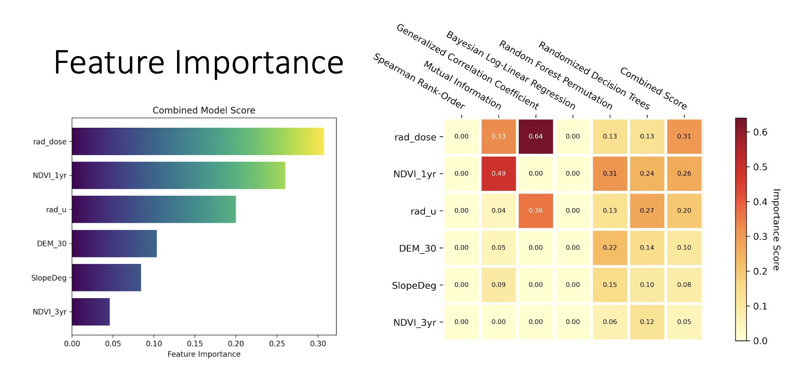
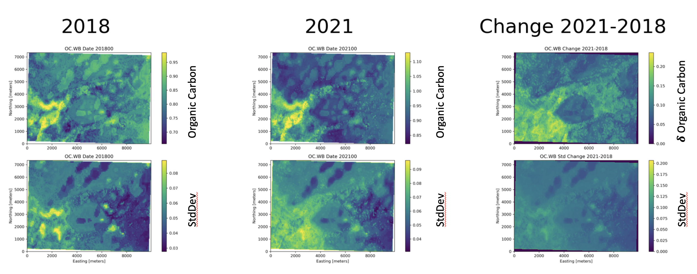

# AgReFed-ML
Machine learning tools for modelling and predicting agriculture systems and their uncertainties.

## Introduction

Agricultural soil models can be either mechanistic (e.g., soil-physics) or of data-driven, statistical nature (e.g., Probabilistic Neural Nets, Bayesian Models, Random Forests), or a combination of both (e.g., for data-driven estimation/optimisation of mechanistic model parameters and their uncertainty). The output of these models, such as spatial-temporal predictions, is used for a wide range of application (e.g., soil, yield, crops, animals). These models require inter-operable data flows of appropriately calibrated, cleaned data variables. Understanding the model limitations, assumptions and then interpreting the outputs is required. This project will contribute software scripts that provide multiple machine learning workflows and tools for agriculture researchers, with a focus on developing a software tool to map soil properties under sparse and uncertain input. Our data-driven models are not restricted to only soil modeling but can be applied for a wide range of environmental model applications.

## Method

One powerful machine learning technique that can be used for soil property prediction is the probabilistic Mixture Model. This model uses Gaussian Process regression with a complex base function and is particularly well-suited to agricultural applications because it can capture the underlying patterns and trends in soil data, as well as the inherent uncertainties associated with soil properties. By using probabilistic Mixture Models, we can generate more accurate and reliable predictions of soil properties, which can be used to inform decision making and optimize crop management. More information about the model details can be found in Methods.pdf.

The complete workflow consists of the following steps:

1) data preprocessing
2) feature analysis and selection
3) mixture-model training, optimization, evaluation, and model selection
4) generating geo-referenced prediction and uncertainty maps


## Functionality

The main functions supported by the worklflow scripts are:

- automatic feature importance analysis and ranking using using a multiple model approach
- generator function for of range of synthetic data for testing
- mutiple machine learning models for soil properties under sparse and uncertain input:
    - static 3D properties
    - change model and temporal covariances
    - spatial-temporal model
- multi-model testing and automatic cross-validation on subsets of train and test data
- visualisation of prediction maps of soil properties and uncertainties

<figure>
    
    <figcaption>Example plot of feature importance scores for multiple models.<figcaption>
</figure> 

## Installation

1) Download or clone github repo
2) Unzip samples.zip in folder notebook, which creates a folder notebook/samples with all sample data files
3) Setup AgReFed environment with conda/mamba (installation):
    - if conda not installed yet, please install (see e.g., for conda-miniforge [https://github.com/conda-forge/miniforge](https://github.com/conda-forge/miniforge)) 
    - run following commands in your terminal, here show for conda (if other environmnet used, please adjust):
    ```bash
    conda env create -n agrefed --file env_agrefed_combined.yaml

    conda activate agrefed

    cd notebooks
    ```
4) Open notebooks (see section below). Notebooks can be run, for example, in Jupyterlab environment, or within VSCode (using Jupyter or Quarto plugin), or via ```jupyter notebook```


## Use Case Scenarios

This project aims to demonstrates ML workflows for three use case scenarios as example applications for agricultural research. Each scenario is described by a reproducible workflow process that includes feature engineering, model selection and validation, and prediction mapping/cubing.

### A) Static Soil Model

The static model is a spatial model for generating prediction maps of soil properties for one given time. The output are geo-referenced prediction and uncertainty maps (2D) at multiple soil depths. The soil model takes into account the spatial and depth correlations via a joint 3D GP kernel with two lengthscale hyperparameters (spatial and depth).
As example use-case, a spatial probabilistic model is trained and predictions are produced for multiple soil properties for the L'lara farm area (see figure below). Soil data and covariates are provided by the University of Sydney.

<figure>
    
    <figcaption>Map of data probe locations for L'lara<figcaption>
</figure> 

#### How to run the static 3D example
Download github repo and run the following three notebooks:
    
    - Feature importance: `feature_importance_static.ipynb`, configure settings in `settings_featureimportance_static.yaml`
    - Model testing: `testmodels_static.ipynb`, configure settings in `settings_testmodels_static.yaml`
    - 3D soil predictions: `prediction_static3d_OC.ipynb`, configure settings in `settings_soilmod_predict_static.yaml`

All notebooks can be found in the folder `notebooks` and the settings file in `notebooks/settings`.

### B) Change Model for Carbon Accounting Mapping

This workflow generates prediction and uncertainty maps for the change of soil properties within a certain period of time. The use-case goal for this example is to model the change of the Organic Carbon (OC) stock volume for a farm. A particular focus is to model the uncertainty of the change, which needs to take into account the covariances of the prediction in space and time. The model training data is based on laboratory measurements of Organic Carbon stock for 2018 and 2021 from sample sites in L'lara

<figure>
    
    <figcaption>Change prediction for Organic Carbon<figcaption>
</figure> 


#### How to run the change model example

Download github repo and run the following notebook: `model_soilchange_OC.ipynb`
This notebook includes the three workflows for feature importance, model selection, and change mapping. The corresponding settings files for these three processes are `settings_featureimportance_OC.yaml`, `settings_featureimportance_OC.yaml` `settings_soilmod_changepredict_OC.yaml`, respectively.


### C) Spatial-Temporal Model

This workflow generates soil moisture prediction maps (for top-soil layer) and their uncertainty for multiple time intervals. Model training data is based on daily and weekly averaged data from soil moisture probes and multiple spatial-temporal dependent covariates for 2020-2022 from sample sites in L'lara. 
Soil moisture data is provided by the University of Sydney and multiple spatial-temporal covariates are extracted with the AgReFed Data Harvester software.


#### How to run the spatial-temporal example
The worklflows for this scenario are included in the following notebooks:
    
    - Feature selection: `feature_selection_moisture.ipynb` (this notebook includes functions for generating settings file)
    - Model testing: `testmodels_st_moisture.ipynb`, configure settings in `settings_soilmod_xval_moisture_20xx.yaml`
    - Prediction notebooks: `prediction_st_moisture.ipynb` + `settings_soilmod_moisture_predict_20xx.yaml` (GPR plus Random Forest),  `prediction_st_blr-gp_moisture.ipynb` + `settings_soilmod_moisture_predict_blr-gp_20xx.yaml` (GPR plus Bayesian Linear Regression)


## Attribution and Acknowledgments

This software was developed by the Sydney Informatics Hub, a core research facility of the University of Sydney, as part of the project `Mechanistic and data-driven models under uncertainty for agricultural systems` for the Agricultural Research Federation (AgReFed).

Acknowledgments are an important way for us to demonstrate the value we bring to your research. Your research outcomes are vital for ongoing funding of the Sydney Informatics Hub.

If you make use of this software for your research project, please include the following acknowledgment:

“This research was supported by the Sydney Informatics Hub, a Core Research Facility of the University of Sydney, and the Agricultural Research Federation (AgReFed)."

AgReFed is supported by the Australian Research Data Commons (ARDC) and the Australian Government through the National Collaborative Research Infrastructure Strategy (NCRIS).

## License

Copyright 2022 The University of Sydney

This is free software: you can redistribute it and/or modify it under
the terms of the GNU Lesser General Public License (LGPL version 3) as
published by the Free Software Foundation.

This program is distributed in the hope that it will be useful, but
WITHOUT ANY WARRANTY; without even the implied warranty of
MERCHANTABILITY or FITNESS FOR A PARTICULAR PURPOSE. See the GNU Lesser
General Public License for more details.

You should have received a copy of the GNU Lesser General Public License
along with this program (see LICENSE). If not, see
<https://www.gnu.org/licenses/>.
