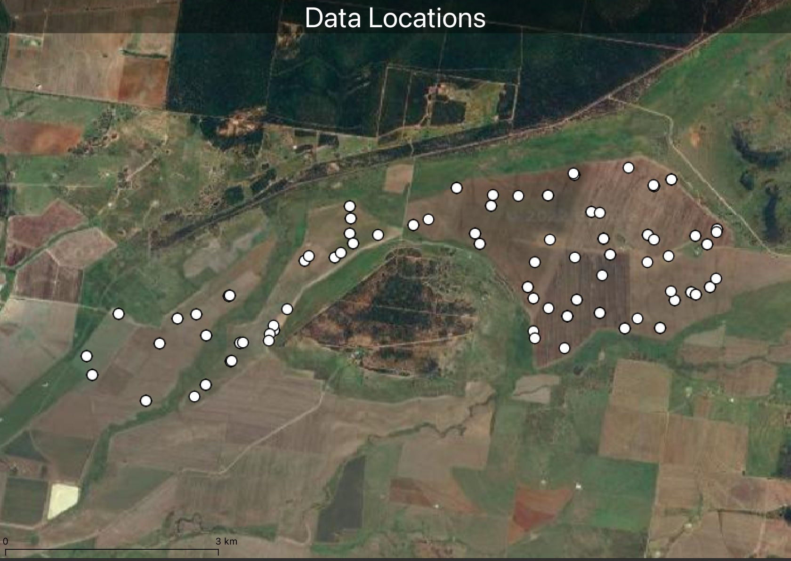
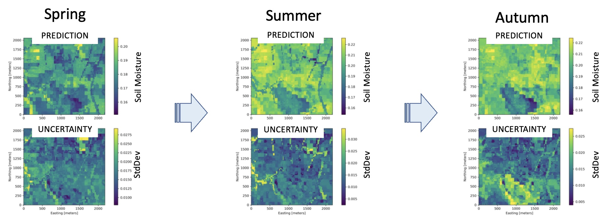

# AgReFed-ML
Data-driven Machine Learning for modelling and predicting agriculture systems and their uncertainties.

<!-- Badges  start -->

[](#license)

<!-- Badges end -->

## Content

- [Introduction](#introduction)
- [Method](#method)
- [Functionality](#functionality)
- [Installation](#installation)
- [Use Case Scenarios](#use-case-scenarios)
- [Contributions](#contributions)
- [Attribution and Acknowledgments](#attribution-and-acknowledgments)
- [License](#license)
- [References](#references)


## Introduction

Machine learning (ML) models have emerged as a powerful approach for building agriculture soil models, allowing researchers to analyze large and complex spatiotemporal datasets to make predictions about soil properties and processes. The output of these models, such as spatiotemporal predictions, is used for a wide range of application (e.g., soil, yield, crops, carbon cycle). These models need to take into account multiple data sources such as ground and subsurface soil measurements, satellite imagery, climate data, and other remote sources. The fusion of these data sources is a challenging task, as it requires the development of inter-operable probabilistic data models and uncertainty quantification. The AgReFed-ML project is contributing software tools that provide reproducible machine learning workflows for agriculture researchers, with a focus on developing applications to map soil properties under sparse and uncertain input. These data-driven models are not limited to soil modeling only, but can be applied for a wide range of environmental applications.

## Method

This model uses Gaussian Process regression with a complex base function and is particularly well-suited to agricultural applications because it can capture the underlying patterns and trends in soil data, as well as the inherent uncertainties associated with soil properties. By using such probabilistic Mixture Model, we can generate more accurate and reliable predictions of soil properties, which can be used to inform decision making and optimize crop management. More information about the probabilistic model details and feature selection can be found in [Method.pdf](docs/Method.pdf).

Each workflow consists of the following main steps:

0) data preprocessing (included sample data already pre-processed)
1) feature analysis and selection
2) model training, optimization, evaluation, and model selection
3) generating geo-referenced prediction and uncertainty maps


## Functionality

The main functions supported by the workflow scripts are:

- automatic feature importance analysis and ranking using using a multiple model approach
- multiple machine learning models for soil properties under sparse and uncertain input:
    - static 3D properties
    - change model and temporal covariances
    - spatial-temporal model
- multi-model testing and automatic cross-validation on subsets of train and test data
- visualisation of prediction maps of soil properties and uncertainties
- support for importing/saving settings using YAML settings files for reproducible workflows
- support for different spatial prediction types (e.g., points, blocks, polygons)
- support for measurement errors in the observations (if provided as part of the input data)
- generator function for of range of synthetic data for testing

<figure>
    
    <figcaption>Example plot of feature importance scores for multiple models.<figcaption>
</figure> 

The modelling approach includes the following features:

- accommodate the spatial (-temporal) support of the observations
- accommodate the spatial (-temporal) auto-correlation of the observations
- accommodate measurement error of the observations
- incorporate numerous variables as predictors (covariates)
- prediction of heteroscedastic uncertainty estimates


## Installation

### Local Installation

1) Download or clone github repo
2) Unzip samples.zip in folder notebook, which creates a folder notebook/samples with all sample data files
3) Setup AgReFed environment with conda/mamba (installation):
    - if conda not installed yet, please install (see e.g., for conda-miniforge [https://github.com/conda-forge/miniforge](https://github.com/conda-forge/miniforge)) 
    - run following commands in your terminal, as shown here for conda (if other environment used, please adjust):
        ```bash
        conda env create --file env_agrefed_combined.yaml

        conda activate agrefed

        cd notebooks
        ```
4) Open notebooks (see section below). Notebooks can be run, for example, in JupyterLab environment, or within VSCode (using Jupyter or Quarto plugin), or via ```jupyter notebook```

The environment file `env_agrefed_combined.yaml` includes all dependencies for this AgReFed Machine Learning project plus all dependencies for the AgReFed Harvester project, so both projects can be run in the same environment.

### AgReFed Nectar Cloud Environment

As play-ground for testing the AgReFed-ML notebooks we provide a pre-installed cloud Python Jupyterlab environment, which does not require any local installation. This Jupyter environment is hosted on the ARDC Nectar Research Cloud in partnership with AgReFed and Australian Research Data Commons (ARDC). Note that this sandbox is currently hosted for test purposes only and generated data is not permanently stored.

To login to this platform, please follow the instructions:
- login to [AgReFed Nectar Cloud](https://jupyterhub.rc.nectar.org.au/hub/login?next=%2Fhub%2F).
- select as Server Option the `AgReFed Python environment` 
- open new Jupyter notebook and run the following command to clone the AgReFed-ML repo to your cloud home directory, and to unzip sample data:
    ```python
    # clone AgReFed-ML repo
    !git clone https://github.com/Sydney-Informatics-Hub/AgReFed-ML
    # unzip sample data
    import zipfile
    with zipfile.ZipFile("./AgReFed-ML/notebooks/samples.zip", 'r') as zip_file:
        zip_file.extractall("./AgReFed-ML/notebooks/")
    ```
- start with opening a AgReFed-ML notebook in the `notebooks` folder

The AgReFed cloud environment is pre-installed with all dependencies for this AgReFed-ML project plus all dependencies for the AgReFed Harvester project, so both projects can be run in the same environment. In case any additional packages are required, please contact us. Alternatively additional packages can be installed via `!pip install` in a new cell in the notebook.


## Use Case Scenarios

This project aims to demonstrates ML workflows for three use case scenarios as example applications for agricultural research. Each scenario is described by a reproducible workflow that includes feature engineering, model selection and validation, and prediction mapping/cubing. The workflows are implemented in Jupyter notebooks and can be run in a local environment. The notebooks are configured using YAML settings files, which can be used to adjust the workflow to different use cases. For how to run the notebooks, see the [Notebooks Guide](notebooks/README.md).

### A) Static Soil Model

The static model is a spatial model for generating prediction maps of soil properties for one given time. The output are geo-referenced prediction and uncertainty maps (2D) at multiple soil depths. The soil model takes into account the spatial and depth correlations via a joint 3D GP kernel with two lengthscale hyperparameters (spatial and depth).
As example use-case, a spatial probabilistic model is trained and predictions are produced for multiple soil properties for a farm area (see figure below). 

<figure>
    
    <figcaption>Map of data probe locations for sample data (included).<figcaption>
</figure> 


### B) Change Model for Carbon Accounting Mapping

This workflow generates prediction and uncertainty maps for the change of soil properties within a certain period of time. The use-case goal for this example is to model the change of the Organic Carbon (OC) stock volume for a farm. A particular focus is to model the uncertainty of the change, which needs to take into account the covariances of the prediction in space and time. 

<figure>
    
    <figcaption>Change prediction for Organic Carbon<figcaption>
</figure> 


### C) Spatial-Temporal Model

This workflow generates soil moisture prediction maps (for top-soil layer) and their uncertainty for multiple time intervals. Model training data is based on daily and weekly averaged data from soil moisture probes and multiple spatial-temporal dependent covariates for 2020-2022 from sample sites. 

<figure>
    
    <figcaption>Spatial-temporal predictions and uncertainty for Organic Carbon at different dates.<figcaption>
</figure> 


## Contributions
We are happy for any contribution to this project, whether feedbacks and bug reports via github Issues, adding use-case examples via notebook contributions, to improving source-code and adding new data examles.

For more details about about how to contribute to the development, please visit the [AgReFed-ML contribution guidelines](docs/Contributing.md).


## Attribution and Acknowledgments

This software was developed by the Sydney Informatics Hub, a core research facility of the University of Sydney, as part of the project `Mechanistic and data-driven models under uncertainty for agricultural systems` for the Agricultural Research Federation (AgReFed).

Acknowledgments are an important way for us to demonstrate the value we bring to your research. Your research outcomes are vital for ongoing funding of the Sydney Informatics Hub.

If you make use of this software for your research project, please include the following acknowledgment:

“This research was supported by the Sydney Informatics Hub, a Core Research Facility of the University of Sydney, and the Agricultural Research Federation (AgReFed)."

AgReFed is supported by the Australian Research Data Commons (ARDC) and the Australian Government through the National Collaborative Research Infrastructure Strategy (NCRIS).

## License

Copyright 2023 The University of Sydney

This is free software: you can redistribute it and/or modify it under the terms of the GNU Lesser General Public License (LGPL version 3) as published by the Free Software Foundation.

This program is distributed in the hope that it will be useful, but
WITHOUT ANY WARRANTY; without even the implied warranty of
MERCHANTABILITY or FITNESS FOR A PARTICULAR PURPOSE. See the GNU Lesser General Public License for more details.

You should have received a copy of the GNU Lesser General Public License
along with this program (see LICENSE). If not, see
<https://www.gnu.org/licenses/>.

## References

- [AgReFed Homepage](https://agrefed.org.au/)

- [AgReFed Geodata-Harvester Overview](https://sydney-informatics-hub.github.io/geodata-harvester/py_dataharvester.html)

- [AgReFed Geodata-Harvester Python Github](https://github.com/Sydney-Informatics-Hub/geodata-harvester)

- [Method documentation](docs/Method.pdf)

- [Feature Importance and Selection](https://pypi.org/project/selectio/)

## Authors

- [Sebastian Haan](https://github.com/sebhaan)