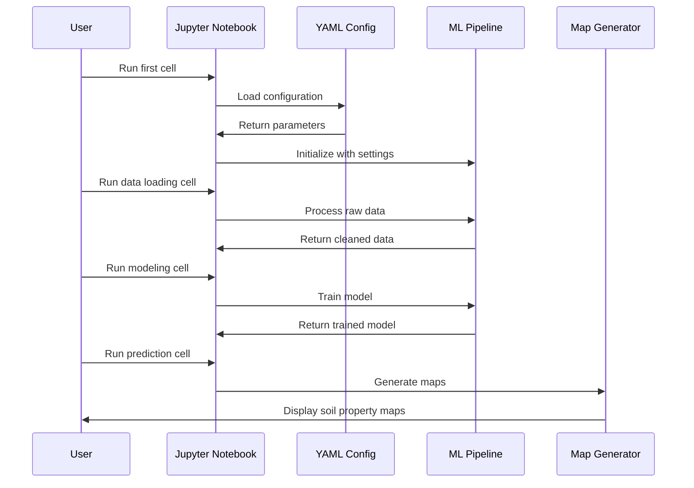

# Chapter 1: Notebook-Based Workflows

Imagine you're learning to cook a complex dish like beef wellington. You wouldn't want to just be handed a list of ingredients and told "figure it out." Instead, you'd want a step-by-step recipe that shows you exactly how to prepare each component, when to combine them, and what the final result should look like.

This is exactly what **Notebook-Based Workflows** provide for agricultural machine learning. Instead of wrestling with complex algorithms and data processing on your own, you get interactive, guided tutorials that walk you through complete analysis scenarios from start to finish.

## What Problem Do Notebook-Based Workflows Solve?

Let's say you're an agricultural researcher who wants to create a soil carbon map for a farm. Without guided workflows, you'd face these challenges:

- **Where do I start?** Should I clean the data first, select features, or jump straight to modeling?
- **Which models work best?** There are dozens of machine learning approaches - how do you choose?
- **How do I handle uncertainty?** Agricultural predictions need confidence intervals, but how do you calculate them?
- **What does good output look like?** How do you know if your soil maps are reasonable?

Notebook-Based Workflows solve this by providing you with proven "recipes" that have been tested and refined by experts.

## What Are Notebook-Based Workflows?

Think of these workflows as interactive cookbooks where:

- **Ingredients** = Your data (soil measurements, satellite imagery, weather data)
- **Cooking techniques** = Machine learning models and data processing steps  
- **Recipe steps** = Code cells that you run one by one
- **Final dishes** = Soil property maps, change detection results, uncertainty analysis

Each workflow is contained in a Jupyter notebook - an interactive document that combines explanations, code, and visualizations all in one place.

## Key Components of a Workflow

Every notebook-based workflow in AgReFed-ML has three main ingredients:

### 1. **Interactive Code Cells**
These are like individual recipe steps. Each cell contains a small piece of code that does one specific task:

```python
# Load your soil data (like getting ingredients from the pantry)
import pandas as pd
soil_data = pd.read_csv('soil_measurements.csv')
print(f"Loaded {len(soil_data)} soil samples")
```

When you run this cell, it loads your data and tells you how many samples you have.

### 2. **Configuration Files (YAML Settings)**
These are like adjustable recipe cards that let you customize the workflow without changing the code:

```yaml
# settings_soil_mapping.yaml
input_file: "my_farm_data.csv"
target_property: "organic_carbon"
map_resolution: 100  # meters
uncertainty_method: "gaussian_process"
```

This settings file tells the workflow which data to use and how detailed you want your final maps.

### 3. **Step-by-Step Guidance**
Each notebook includes detailed explanations between code cells, just like a good recipe explains why you're doing each step.

## How to Use Notebook-Based Workflows

Let's walk through creating a soil organic carbon map using the static soil model workflow:

### Step 1: Choose Your Recipe
AgReFed-ML provides three main "recipe categories":

- **Static Soil Model**: Create property maps for a single point in time
- **Change Model**: Track how soil properties change over time  
- **Spatial-Temporal Model**: Model properties that vary across both space and time

For our carbon mapping example, we'll use the Static Soil Model.

### Step 2: Prepare Your Ingredients
Open the feature selection notebook:

```python
# This notebook helps you pick the best predictors for your model
# Like choosing which spices will make your dish taste best
from notebooks import feature_importance_static
```

### Step 3: Follow the Recipe
Run each cell in sequence. The notebook guides you through:

```python
# Step 1: Load and explore your data
soil_data = load_data('my_soil_samples.csv')

# Step 2: Analyze which features are most important  
important_features = analyze_feature_importance(soil_data)

# Step 3: Select the best features for modeling
selected_features = select_top_features(important_features, n_features=10)
```

Each step produces output that helps you understand what's happening with your data.

### Step 4: Cook Your Model
Move to the prediction notebook and create your soil maps:

```python
# Train your model using the selected features
model = train_soil_model(soil_data, selected_features)

# Generate prediction maps
carbon_map = predict_soil_property(model, prediction_grid)

# Create uncertainty maps too
uncertainty_map = predict_uncertainty(model, prediction_grid)
```

## What Happens Under the Hood

When you run a notebook-based workflow, here's the step-by-step process that occurs:



Let's break this down:

1. **Configuration Loading**: The notebook first reads your YAML settings file to understand what you want to accomplish
2. **Data Processing**: Your raw data gets cleaned and prepared using the [Data Preprocessing Pipeline](03_data_preprocessing_pipeline.md)
3. **Model Training**: The system trains machine learning models using the [Mean Function Models](04_mean_function_models__.md) and [Gaussian Process Models](05_gaussian_process_models.md)
4. **Prediction Generation**: The trained model creates maps using [Prediction Workflows](02_prediction_workflows.md)
5. **Uncertainty Quantification**: The [Uncertainty Quantification System](06_uncertainty_quantification_system.md) calculates confidence intervals for each prediction

## Implementation Details

The notebook workflows are built on top of several core components. Here's how they work together:

### Workflow Orchestration
```python
# Each notebook follows this general pattern:
def run_workflow(settings_file):
    # 1. Load configuration
    config = load_yaml_settings(settings_file)
    
    # 2. Initialize data pipeline  
    data_pipeline = DataPreprocessingPipeline(config)
    
    # 3. Set up model based on use case
    if config['workflow_type'] == 'static':
        model = StaticSoilModel(config)
    elif config['workflow_type'] == 'change':
        model = ChangeDetectionModel(config)
    
    # 4. Execute workflow steps
    results = model.run_complete_workflow()
    
    return results
```

This orchestration ensures that each workflow follows the same reliable pattern while allowing for customization through the settings files.

### Interactive Feedback
```python
# Notebooks provide real-time feedback at each step
def display_progress(step_name, data):
    print(f"✓ Completed: {step_name}")
    print(f"  Data shape: {data.shape}")
    print(f"  Memory usage: {data.memory_usage().sum() / 1024**2:.1f} MB")
    
    # Show sample of results
    display(data.head())
```

This helps you understand what's happening at each stage and catch any issues early.

## Benefits for Beginners

Notebook-Based Workflows make agricultural machine learning accessible because they:

- **Provide Structure**: No need to guess what comes next
- **Include Validation**: Each step checks that your data looks reasonable  
- **Offer Flexibility**: Change settings without modifying code
- **Show Results**: Visualize your data and results at each step
- **Enable Reproducibility**: Share your exact workflow with colleagues

## Conclusion

Notebook-Based Workflows transform complex agricultural machine learning tasks into manageable, step-by-step processes. Like following a well-tested recipe, you can create sophisticated soil property maps and uncertainty analyses without needing to be a machine learning expert.

These workflows serve as your foundation for all AgReFed-ML analyses. Once you're comfortable with the basic flow, you can explore the specific prediction workflows and advanced modeling techniques covered in the following chapters.

Ready to dive deeper into the mechanics? The next chapter covers [Prediction Workflows](02_prediction_workflows.md), where we'll explore how the system actually generates those soil property maps and uncertainty estimates.

