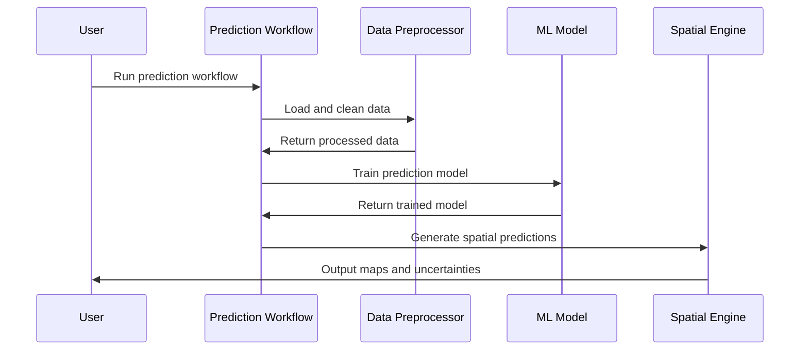

# Chapter 2: Prediction Workflows

Now that you've learned how [Notebook-Based Workflows](01_notebook_based_workflows_.md) provide structured, step-by-step guides for agricultural machine learning, it's time to explore the engine that powers these workflows: **Prediction Workflows**.

Think of this relationship like a cookbook and kitchen equipment. The notebook-based workflows are your recipe cards that guide you through each step, while prediction workflows are the specialized kitchen tools - your food processor, stand mixer, and precision thermometer - that actually do the heavy lifting to create your final dish.

## What Problem Do Prediction Workflows Solve?

Imagine you're a photographer with three different assignments:

1. **Portrait Photography**: Taking a single perfect headshot of someone
2. **Before-and-After Photography**: Documenting a home renovation over 6 months  
3. **Time-lapse Photography**: Capturing a flower blooming over several days

Each scenario requires different camera settings, techniques, and equipment. You wouldn't use the same approach for all three - and the same applies to soil modeling.

Agricultural researchers face similar diverse scenarios:

- **Mapping current soil carbon**: Creating a snapshot of soil organic carbon levels across a farm right now
- **Carbon accounting**: Tracking how soil carbon changes over time for carbon credit programs
- **Soil moisture monitoring**: Predicting how soil moisture varies across space and time for irrigation planning

Each of these scenarios needs a specialized approach, and that's exactly what Prediction Workflows provide.

## The Three Types of Prediction Workflows

Like having different camera modes, AgReFed-ML provides three specialized prediction workflows:

### 1. **Static Soil Model** - The Portrait Mode
This workflow creates detailed maps of soil properties for a single point in time. Perfect for:
- Baseline soil mapping
- Property assessment for land purchases
- Creating reference maps for crop planning

### 2. **Change Detection Model** - The Before-and-After Mode  
This workflow compares soil properties between two specific time periods. Ideal for:
- Carbon accounting and verification
- Monitoring soil health improvements
- Assessing impact of management practices

### 3. **Spatial-Temporal Model** - The Time-lapse Mode
This workflow models how soil properties vary continuously across both space and time. Great for:
- Soil moisture forecasting
- Dynamic nutrient management
- Climate change impact studies

## How to Use Prediction Workflows

Let's walk through using each workflow type with practical examples.

### Using the Static Soil Model

Suppose you want to create a soil organic carbon map for a 500-hectare farm. Here's how you'd configure and run the static workflow:

```python
# Configure the static soil model
settings = {
    'model_function': 'rf-gp',  # Random Forest + Gaussian Process
    'name_target': 'organic_carbon',
    'axistype': 'vertical',
    'integrate_block': False  # Use point predictions
}
```

This tells the system you want to predict organic carbon using a combined Random Forest and Gaussian Process model, focusing on vertical (depth-based) soil mapping.

```python
# Run the static prediction workflow
from soilmod_predict import main
main('settings_static_carbon.yaml')
```

**What you get**: The system produces soil carbon maps for different depths (e.g., 0-10cm, 10-20cm, 20-30cm) along with uncertainty maps showing prediction confidence.

### Using the Change Detection Model

Now let's say you need to verify carbon sequestration for a carbon credit program by comparing 2018 and 2023 measurements:

```python
# Configure the change detection model
settings = {
    'model_function': 'blr-gp',  # Bayesian Linear Regression + GP
    'name_target': 'organic_carbon',
    'list_t_pred': [2018, 2023],  # Two specific years
    'axistype': 'temporal'
}
```

```python
# Run the change detection workflow  
from soilmod_predict_change import main
main('settings_carbon_change.yaml')
```

**What you get**: Maps showing carbon levels for both years, plus a change map highlighting areas of carbon gain or loss, complete with statistical significance testing.

### Using the Spatial-Temporal Model

For dynamic soil moisture management across a growing season:

```python
# Configure spatial-temporal model
settings = {
    'model_function': 'rf-gp',
    'name_target': 'soil_moisture',
    'list_t_pred': [1, 30, 60, 90, 120],  # Days after planting
    'integrate_block': True  # Use block averaging
}
```

```python
# Run the spatial-temporal workflow
from soilmod_predict_st import main  
main('settings_moisture_timeseries.yaml')
```

**What you get**: A series of soil moisture maps for each time point, allowing you to see how moisture patterns evolve across your field throughout the growing season.

## What Happens Under the Hood

When you run a prediction workflow, here's the step-by-step process that occurs:



Let's break this down:

1. **Data Loading and Validation**: The workflow first loads your soil measurements and covariate data, checking for missing values and coordinate system consistency.

2. **Preprocessing**: The [Data Preprocessing Pipeline](03_data_preprocessing_pipeline.md) cleans your data, handles outliers, and prepares features for modeling.

3. **Model Training**: Depending on your choice, the system trains either [Mean Function Models](04_mean_function_models___.md) (like Random Forest) or [Gaussian Process Models](05_gaussian_process_models.md) to learn relationships between soil properties and environmental factors.

4. **Spatial Prediction**: The trained model generates predictions across your study area, using the [Spatial-Temporal Modeling Framework](07_spatial_temporal_modeling_framework.md) to handle geographic relationships.

5. **Uncertainty Quantification**: The [Uncertainty Quantification System](06_uncertainty_quantification_system.md) calculates prediction confidence intervals and maps areas of high/low uncertainty.

## Implementation Details

Each prediction workflow is implemented as a specialized Python module that orchestrates the complete modeling process. Here's how the core prediction engine works:

### Workflow Selection Logic
```python
def select_workflow_type(settings):
    """Choose appropriate workflow based on settings"""
    if len(settings.list_z_pred) == 1:
        return 'static'  # Single time point
    elif len(settings.list_z_pred) == 2:
        return 'change'  # Two time points for comparison  
    else:
        return 'spatial_temporal'  # Multiple time points
```

This simple logic routes your analysis to the appropriate specialized workflow based on how many time points you want to analyze.

### Model Training and Prediction
```python
# Train the mean function (Random Forest or Bayesian Linear Regression)
if mean_function == 'rf':
    rf_model = rf.rf_train(X_train, y_train)
    y_pred_mean, noise_pred = rf.rf_predict(X_test, rf_model)
    
# Add Gaussian Process for spatial modeling (if selected)
if not calc_mean_only:
    gp_pred, gp_uncertainty = gp.train_predict_3D(
        points3D_train, points3D_pred, 
        y_residuals, noise_train, gp_params
    )
```

This two-stage approach first learns the main relationships using machine learning, then uses Gaussian Processes to model spatial patterns in the residuals.

### Spatial Integration

For different spatial support (points, blocks, or polygons), the workflows use different aggregation strategies:

```python
# For block predictions - average over multiple points
if settings.integrate_block:
    block_mean, block_std = averagestats(point_predictions, covariance_matrix)
    
# For point predictions - direct mapping
else:
    prediction_map = align_nearest_neighbor(grid_coords, predictions)
```

This ensures your predictions match the spatial resolution and support you need for your specific application.

### Output Generation

All workflows automatically generate:
- **Prediction maps** as both images (PNG) and GIS files (GeoTIFF)
- **Uncertainty maps** showing prediction confidence
- **Summary statistics** for model performance assessment
- **Visualization plots** for immediate interpretation

```python
# Save results in multiple formats
array2geotiff(prediction_map, coordinates, resolution, 
              output_file + '.tif', projection)
plt.savefig(output_file + '.png', dpi=300)
np.savetxt(output_file + '.txt', prediction_values)
```

## Benefits of Specialized Workflows

Each workflow is optimized for its specific use case:

- **Static workflows** focus on producing the most accurate single-time maps with detailed uncertainty analysis
- **Change workflows** emphasize proper statistical testing and significance of temporal differences  
- **Spatial-temporal workflows** efficiently handle large datasets across multiple time points

This specialization means you get better results faster, without having to worry about configuring complex modeling parameters for each scenario.

## Conclusion

Prediction Workflows are the specialized engines that power AgReFed-ML's soil modeling capabilities. Like having the right camera mode for different photography scenarios, these workflows ensure you're using the optimal approach for your specific agricultural question.

Whether you need a single snapshot of soil conditions, want to track changes over time, or require dynamic spatial-temporal predictions, there's a workflow designed specifically for your needs. The workflows handle all the complex data processing, model training, and spatial prediction generation automatically, while giving you complete control over the modeling approach through simple configuration files.

Ready to dive deeper into how your data gets prepared for these workflows? The next chapter covers the [Data Preprocessing Pipeline](03_data_preprocessing_pipeline.md), where we'll explore how AgReFed-ML transforms your raw soil measurements into analysis-ready datasets.
