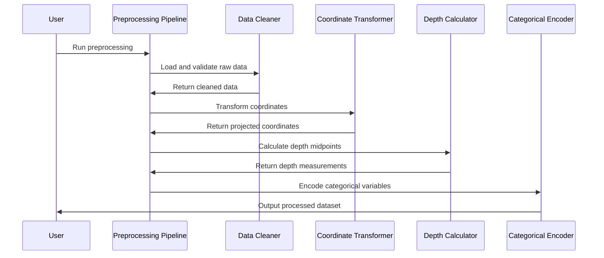

# Chapter 3: Data Preprocessing Pipeline

Now that you've learned how [Prediction Workflows](02_prediction_workflows.md) create soil property maps, it's time to explore the essential foundation that makes those workflows possible: the **Data Preprocessing Pipeline**.

Think of this relationship like preparing ingredients before cooking. The [Prediction Workflows](02_prediction_workflows.md) are your cooking techniques - sautéing, roasting, and seasoning - that create the final dish. But before you can cook anything, you need perfectly prepped ingredients: vegetables washed and chopped to uniform sizes, spices measured, and everything organized by cooking order. That's exactly what the Data Preprocessing Pipeline does for your soil data.

## What Problem Does the Data Preprocessing Pipeline Solve?

Imagine you're a chef who just received a delivery of fresh produce from three different farms. Here's what you might find:

- **Inconsistent measurements**: One farm measures potatoes in pounds, another in kilograms, and the third just says "large, medium, small"
- **Missing information**: Some vegetables have no harvest date labels
- **Different coordinate systems**: Farm locations are recorded using different GPS formats
- **Messy data**: Soil still attached, some produce damaged, mixed varieties

This is exactly what happens when you collect soil measurements from multiple sources:

- **Mixed units**: Some labs report organic carbon as percentages, others as grams per kilogram
- **Missing measurements**: Weather data missing for certain dates, GPS coordinates incomplete
- **Different coordinate systems**: Some measurements use latitude/longitude, others use local grid coordinates
- **Data quality issues**: Impossible values (like negative soil pH), inconsistent depth recordings

The Data Preprocessing Pipeline solves all these problems, transforming your messy, real-world soil data into clean, consistent datasets ready for machine learning.

## What Is the Data Preprocessing Pipeline?

Think of the Data Preprocessing Pipeline as a professional kitchen prep station with specialized equipment for each task:

- **Washing station** = Data cleaning and validation
- **Cutting station** = Unit conversions and standardization  
- **Measuring station** = Coordinate system transformations
- **Organization station** = Spatial and temporal alignment
- **Quality control** = Missing data handling and outlier detection
- **Recipe preparation** = Cross-validation setup for model training

Just like a prep station, the pipeline follows a systematic workflow that ensures every ingredient (data point) is perfectly prepared before it reaches the cooking stage (modeling).

## Key Components of the Data Preprocessing Pipeline

The pipeline consists of five main prep stations that your data moves through sequentially:

### 1. **Data Cleaning and Validation Station**

This is like the washing station where you remove dirt and identify damaged produce.

```python
# Load raw soil measurements
soil_data = pd.read_csv('raw_soil_measurements.csv')

# Remove impossible values (like negative organic carbon)
soil_data = soil_data[soil_data['organic_carbon'] >= 0]

# Check for complete coordinate information
soil_data = soil_data.dropna(subset=['x', 'y'])
```

This step identifies and removes data points that would cause problems later, like soil pH values above 14 or GPS coordinates in the middle of the ocean.

### 2. **Coordinate Transformation Station**  

This is like converting recipe measurements from cups to grams - ensuring everything uses the same measurement system.

```python
# Convert latitude/longitude to projected coordinates (meters)
if 'Latitude' in soil_data.columns:
    soil_data = transform_coordinates(
        soil_data, 
        from_crs='EPSG:4326',  # Lat/Long
        to_crs='EPSG:28355'    # Local grid in meters
    )
```

This ensures all your spatial measurements are in consistent units (typically meters) and use the same map projection, which is essential for accurate spatial modeling.

### 3. **Depth Calculation Station**

This is like converting "thick-cut" and "thin-slice" into precise measurements in millimeters.

```python
# Calculate depth midpoints from depth ranges
soil_data['depth_midpoint'] = (
    soil_data['depth_min'] + soil_data['depth_max']
) / 2

# Convert from millimeters to meters
soil_data['depth_meters'] = soil_data['depth_midpoint'] / 1000
```

Since soil samples are collected over depth ranges (like 0-10cm), this step calculates precise depth midpoints that models can work with mathematically.

### 4. **Categorical Encoding Station**

This is like converting "red onion, yellow onion, white onion" into separate ingredient categories.

```python
# Convert soil types into binary features
soil_types = soil_data['soil_type'].unique()  # ['clay', 'sand', 'loam']

# Create separate columns for each soil type
for soil_type in soil_types:
    soil_data[f'soil_type_{soil_type}'] = (
        soil_data['soil_type'] == soil_type
    ).astype(int)
```

Machine learning models need numbers, not text, so this step converts categorical information (like soil type or land use) into numerical features.

### 5. **Cross-Validation Setup Station**

This is like organizing your ingredients into separate prep containers for each course of a multi-course meal.

```python
# Create validation groups for model testing
soil_data = create_cv_folds(
    soil_data, 
    n_folds=5,
    grouping_precision=1000  # Group points within 1km
)
```

This step creates data splits for model training and testing, ensuring that nearby soil samples don't end up in both training and testing sets (which would give overly optimistic results).

## How to Use the Data Preprocessing Pipeline

Let's walk through preprocessing soil organic carbon data from a real farm. You'll start with messy field measurements and end with analysis-ready data.

### Step 1: Prepare Your Configuration

Create a settings file that tells the pipeline how to handle your specific data:

```yaml
# settings_preprocessing.yaml
inpath: "raw_data/"
infname: "farm_soil_samples.csv"
outpath: "processed_data/"
outfname: "clean_soil_data.csv"

name_target: "organic_carbon"
name_features: ["elevation", "slope", "ndvi", "rainfall"]

# Coordinate column names in your raw data
colname_xcoord: "Easting"  
colname_ycoord: "Northing"

# Depth column names  
colname_depthmin: "depth_top_cm"
colname_depthmax: "depth_bottom_cm"

# Depth limits for analysis
zmin: 0    # Surface samples only
zmax: 0.3  # Down to 30cm depth

# Coordinate system
project_crs: "EPSG:28355"  # Local grid coordinate system
```

This configuration tells the pipeline exactly how to interpret your data columns and what processing steps to apply.

### Step 2: Run the Preprocessing Pipeline

```python
from preprocessing import main

# Run the complete preprocessing pipeline
main('settings_preprocessing.yaml')
```

That's it! The pipeline automatically processes your data through all five stations.

### Step 3: Examine the Results

```python
# Load the processed data
clean_data = pd.read_csv('processed_data/clean_soil_data.csv')

print(f"Original samples: {len(raw_data)}")
print(f"Clean samples: {len(clean_data)}")
print(f"Removed {len(raw_data) - len(clean_data)} problematic samples")

# Check the new columns
print("New columns added:", clean_data.columns.tolist())
```

You'll see that the pipeline has added new columns like depth midpoints, converted coordinates, and cross-validation fold labels.

## What Happens Under the Hood

When you run the preprocessing pipeline, here's the step-by-step process that occurs behind the scenes:



Let's break down what happens at each step:

### 1. **Data Loading and Initial Cleaning**

```python
# Load raw data and identify coordinate columns
df = pd.read_csv(input_file)

# Find latitude/longitude columns with flexible naming
if 'Latitude' in df.columns or 'Lat' in df.columns:
    # Standardize coordinate column names
    df = standardize_coordinate_names(df)
```

The pipeline is smart about finding coordinate columns even if they have different names like "Lat/Long", "Latitude/Longitude", or "X/Y".

### 2. **Coordinate System Validation and Transformation**

```python
# Check if coordinates are already in meters or degrees
coord_range_x = abs(df.x.max() - df.x.min())
coord_range_y = abs(df.y.max() - df.y.min())

if coord_range_x < 5 and coord_range_y < 5:
    print("WARNING: Coordinates may be in degrees, not meters!")
    print("Please verify coordinate system in settings")
```

This validation step catches common mistakes where people forget to convert latitude/longitude coordinates to projected coordinates.

### 3. **Depth Processing and Unit Conversion**

```python
# Calculate depth midpoints and convert units
if depth_min_col and depth_max_col:
    # Convert from centimeters to meters
    df['depth_midpoint'] = 0.5 * (
        df[depth_min_col] + df[depth_max_col]
    ) / 100.0
    
    # Calculate depth interval size
    df['depth_interval'] = (
        df[depth_max_col] - df[depth_min_col]
    ) / 100.0
```

This ensures all depth measurements are in consistent units (meters) and provides both midpoint depths for modeling and interval sizes for uncertainty calculations.

### 4. **Categorical Variable Processing**

```python
# Automatically detect categorical columns (text-based)
categorical_columns = df.select_dtypes(include=['object']).columns

# Convert each categorical variable to binary features
for cat_col in categorical_columns:
    categories = df[cat_col].unique()
    
    for category in categories:
        new_col_name = f"{cat_col}_{category}"
        df[new_col_name] = (df[cat_col] == category).astype(int)
```

This automatic detection and conversion means you don't have to manually specify which columns contain categorical data.

### 5. **Cross-Validation Fold Generation**

```python
def create_spatial_cv_folds(df, n_folds, precision_meters):
    # Create unique location IDs by rounding coordinates
    df['location_id'] = (
        df['x'].round(-2).astype(str) + '_' +  # Round to nearest 100m
        df['y'].round(-2).astype(str)
    )
    
    # Assign folds based on unique locations
    unique_locations = df['location_id'].unique()
    np.random.shuffle(unique_locations)
    
    fold_size = len(unique_locations) // n_folds
    df['cv_fold'] = 0
    
    for fold in range(n_folds):
        start_idx = fold * fold_size
        end_idx = start_idx + fold_size
        fold_locations = unique_locations[start_idx:end_idx]
        df.loc[df['location_id'].isin(fold_locations), 'cv_fold'] = fold + 1
        
    return df
```

This spatial cross-validation ensures that samples from the same location don't end up in both training and testing sets, which would lead to overly optimistic model performance estimates.

## Implementation Details

The preprocessing pipeline is implemented across several specialized modules that work together seamlessly. Here's how the core components work:

### Main Preprocessing Function

```python
def preprocess(inpath, infname, outpath, outfname, name_target, name_features,
               zmin=None, zmax=None, **kwargs):
    """Main preprocessing orchestrator"""
    
    # Load raw data
    df = pd.read_csv(os.path.join(inpath, infname))
    
    # Apply coordinate transformations
    df = handle_coordinates(df, **kwargs)
    
    # Process depth information
    df = calculate_depths(df, **kwargs)
    
    # Handle categorical variables
    df = encode_categoricals(df, **kwargs)
    
    # Filter by depth range
    if zmin is not None or zmax is not None:
        df = filter_by_depth(df, zmin, zmax)
    
    # Remove invalid values
    df = clean_invalid_values(df)
    
    # Save processed data
    df.to_csv(os.path.join(outpath, outfname), index=False)
```

This main function orchestrates all the preprocessing steps while allowing for flexible configuration through keyword arguments.

### Coordinate Transformation Handler

```python
def handle_coordinates(df, colname_xcoord='x', colname_ycoord='y', 
                      project_crs=None, **kwargs):
    """Handle coordinate system transformations"""
    
    # Standardize coordinate column names
    if colname_xcoord != 'x' and colname_xcoord in df.columns:
        df.rename(columns={colname_xcoord: 'x'}, inplace=True)
    if colname_ycoord != 'y' and colname_ycoord in df.columns:
        df.rename(columns={colname_ycoord: 'y'}, inplace=True)
    
    # Convert to projected coordinates if needed
    if project_crs and has_lat_lon_columns(df):
        df = project_to_crs(df, project_crs)
    
    return df
```

This function handles the complex task of coordinate system transformations while being flexible enough to work with different input formats.

### Cross-Validation Fold Generator

The pipeline includes a sophisticated cross-validation setup that considers the spatial nature of soil data:

```python
def gen_kfold(df, nfold, spatial_precision=None):
    """Generate spatially-aware cross-validation folds"""
    
    if spatial_precision:
        # Group nearby samples together
        df['spatial_id'] = create_spatial_groups(df, spatial_precision)
        unique_groups = df['spatial_id'].unique()
    else:
        # Use individual samples
        unique_groups = df.index.values
    
    # Randomly assign groups to folds
    np.random.shuffle(unique_groups)
    fold_size = len(unique_groups) // nfold
    
    for fold in range(nfold):
        fold_groups = unique_groups[fold * fold_size:(fold + 1) * fold_size]
        if spatial_precision:
            df.loc[df['spatial_id'].isin(fold_groups), 'cv_fold'] = fold + 1
        else:
            df.loc[fold_groups, 'cv_fold'] = fold + 1
    
    return df
```

This ensures that your model evaluation accounts for the spatial correlation in soil data, giving you realistic performance estimates.

## Benefits of the Preprocessing Pipeline

The Data Preprocessing Pipeline transforms agricultural machine learning from a frustrating data wrangling exercise into a streamlined workflow:

- **Handles Messy Real-World Data**: Automatically deals with common data quality issues that would otherwise require hours of manual cleaning
- **Ensures Spatial Consistency**: Manages coordinate system transformations and spatial alignment automatically
- **Prevents Common Mistakes**: Built-in validation catches errors like mixed units or invalid coordinates before they cause problems
- **Enables Robust Evaluation**: Sets up proper cross-validation that accounts for spatial correlation in soil data
- **Maintains Reproducibility**: Configuration files ensure preprocessing steps are documented and repeatable

## Conclusion

The Data Preprocessing Pipeline is the essential foundation that makes all other AgReFed-ML capabilities possible. Like a well-organized kitchen prep station, it transforms messy, inconsistent raw soil measurements into clean, standardized datasets ready for sophisticated machine learning analysis.

By handling coordinate transformations, depth calculations, categorical encoding, and cross-validation setup automatically, the pipeline eliminates the tedious data preparation work that often consumes 80% of a machine learning project's time. This lets you focus on the interesting parts: understanding your soil data and generating actionable insights.

Now that your data is perfectly prepped and ready to use, you can move on to the actual modeling techniques. The next chapter covers [Mean Function Models](04_mean_function_models___.html), where you'll learn about the machine learning algorithms that learn the primary relationships between soil properties and environmental factors.

---
