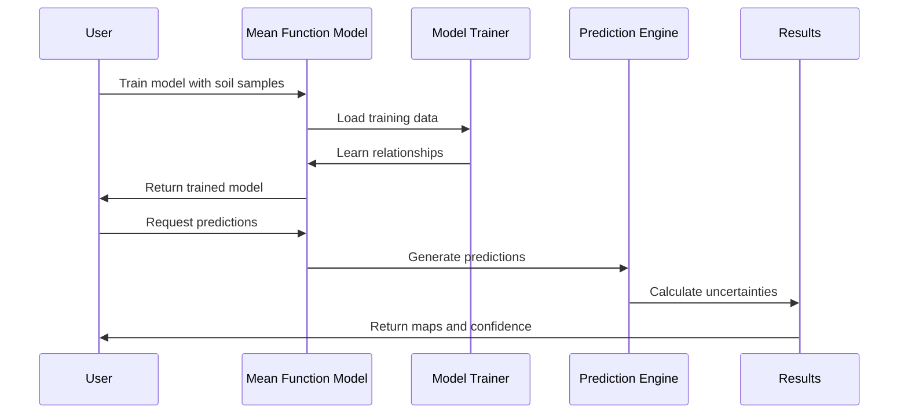

# Chapter 4: Mean Function Models

Now that you've learned how the [Data Preprocessing Pipeline](03_data_preprocessing_pipeline.md) transforms your messy soil measurements into clean, analysis-ready datasets, it's time to explore the first layer of AgReFed-ML's prediction system: **Mean Function Models**.

Think of this relationship like creating a masterpiece painting. The [Data Preprocessing Pipeline](03_data_preprocessing_pipeline.md) is like preparing your canvas and organizing your paints. Mean Function Models are like having a skilled sketch artist create the basic outline and composition of your painting. This rough sketch captures the main shapes, proportions, and overall structure. Later, a master artist (the [Gaussian Process Models](05_gaussian_process_models.md)) will add fine details, subtle shading, and beautiful textures to create the final masterpiece.

## What Problem Do Mean Function Models Solve?

Imagine you're trying to predict soil organic carbon levels across a 1,000-hectare farm. You have soil measurements from 50 sample points scattered across the property, plus environmental data like elevation, rainfall, vegetation indices, and slope for every square meter of the farm.

Without Mean Function Models, you'd face these challenges:

- **Where to start?** How do you begin making predictions when you only have 50 soil samples but need predictions for millions of locations?
- **Which patterns matter?** With dozens of environmental variables, which ones actually help predict soil carbon?
- **How accurate can you be?** What's a reasonable baseline level of accuracy to expect?

Mean Function Models solve these problems by learning the **primary relationships** between soil properties and environmental factors. They're called "mean function" models because they predict the average (mean) soil property value you'd expect at any location, given the environmental conditions there.

## What Are Mean Function Models?

Think of Mean Function Models as experienced agricultural consultants who can give you a good first estimate of soil conditions based on what they can see about the landscape:

- **The Consultant's Expertise** = The trained machine learning model
- **The Landscape Clues** = Environmental covariates (elevation, rainfall, vegetation indices)
- **The Initial Assessment** = Predicted soil property values
- **The Confidence Level** = Uncertainty estimates about the predictions

AgReFed-ML provides two types of agricultural consultants, each with different strengths:

### 1. **Bayesian Linear Regression (BLR) - The Systematic Analyst**
This consultant likes to find simple, interpretable relationships. BLR assumes that soil properties change in predictable, linear ways with environmental factors. For example: "For every 100 meters of elevation gain, soil organic carbon typically increases by 0.2%."

### 2. **Random Forest (RF) - The Pattern Recognition Expert** 
This consultant is excellent at finding complex, non-linear patterns. RF can discover relationships like: "High soil carbon occurs when elevation is above 300m AND rainfall is between 800-1200mm AND the area has moderate slope."

## Key Components of Mean Function Models

Every Mean Function Model in AgReFed-ML has three essential components:

### 1. **Environmental Covariates (The Clues)**
These are the landscape characteristics that help predict soil properties:

```python
# Common environmental covariates
covariates = [
    'elevation',        # Height above sea level
    'slope',           # Steepness of terrain  
    'aspect',          # Direction slope faces
    'ndvi',            # Vegetation greenness
    'rainfall',        # Annual precipitation
    'temperature'      # Average temperature
]
```

These covariates are available everywhere across your study area, unlike soil measurements which are only available at sample points.

### 2. **Training Process (Learning from Examples)**
The model learns relationships by studying your soil sample locations:

```python
# Training data: known soil samples + their environmental conditions
X_train = environmental_data_at_sample_points  # Shape: (50 samples, 6 covariates)
y_train = soil_carbon_measurements             # Shape: (50 samples,)

# Train the model to learn the relationships
model = train_model(X_train, y_train)
```

The model studies these 50 examples to learn how environmental conditions relate to soil carbon levels.

### 3. **Prediction Process (Making Estimates Everywhere)**
Once trained, the model can predict soil properties anywhere:

```python
# Prediction data: environmental conditions everywhere on the farm
X_predict = environmental_data_full_farm  # Shape: (1,000,000 locations, 6 covariates)

# Generate predictions across the entire farm
predictions = model.predict(X_predict)   # Shape: (1,000,000 predictions,)
```

Now you have soil carbon estimates for every location on your farm!

## How to Use Mean Function Models

Let's walk through creating a soil organic carbon map using both types of mean function models.

### Step 1: Choose Your Model Type

For soil organic carbon mapping, you need to decide between the two consultant types:

```python
# Option 1: Bayesian Linear Regression (good for simple relationships)
model_type = 'blr'

# Option 2: Random Forest (good for complex patterns)
model_type = 'rf'
```

**When to use BLR**: When you want interpretable results and suspect simple relationships (e.g., "carbon increases with elevation")

**When to use RF**: When you suspect complex interactions between variables (e.g., "high carbon occurs under specific combinations of elevation, rainfall, and slope")

### Step 2: Train the Bayesian Linear Regression Model

Let's start with the systematic analyst approach:

```python
from model_blr import blr_train

# Train BLR model on your soil samples
blr_model = blr_train(X_train, y_train)
```

This trains the BLR model to find the best linear relationships between environmental factors and soil carbon. The model will identify which environmental variables are most important and how strongly they relate to soil carbon.

### Step 3: Make Predictions with BLR

```python
from model_blr import blr_predict

# Generate predictions and uncertainty estimates
predictions, uncertainties, _ = blr_predict(X_predict, blr_model)
```

The BLR model returns two things:
- **Predictions**: Estimated soil carbon values for each location
- **Uncertainties**: How confident the model is about each prediction

### Step 4: Train the Random Forest Model

Now let's try the pattern recognition expert:

```python
from model_rf import rf_train

# Train RF model on the same soil samples
rf_model = rf_train(X_train, y_train)
```

The Random Forest trains 1,000 decision trees, each learning slightly different patterns from your data. This ensemble approach makes RF very robust to noise and capable of capturing complex relationships.

### Step 5: Make Predictions with Random Forest

```python
from model_rf import rf_predict

# Generate predictions with uncertainty from tree ensemble
predictions, uncertainties, _ = rf_predict(X_predict, rf_model)
```

Random Forest estimates uncertainty by looking at how much the 1,000 different trees disagree with each other. High disagreement means high uncertainty.

## What Happens Under the Hood

When you train and use a Mean Function Model, here's the step-by-step process that occurs:



Let's break this down:

### 1. **Model Training Phase**
```python
# The model studies your soil samples
def learn_relationships(soil_samples, environmental_data):
    # Find patterns like: "High elevation → High carbon"
    # Or: "Steep slopes + High rainfall → Low carbon"
    relationships = find_patterns(soil_samples, environmental_data)
    return trained_model
```

During training, the model examines each soil sample location and asks: "What environmental conditions led to this soil carbon level?"

### 2. **Pattern Learning Process**
For **Bayesian Linear Regression**:
```python
# BLR finds the best linear equation
# soil_carbon = a₁×elevation + a₂×rainfall + a₃×slope + constant
def find_linear_relationships(X, y):
    coefficients = calculate_best_fit(X, y)  # Find a₁, a₂, a₃, etc.
    uncertainties = estimate_coefficient_uncertainty(coefficients)
    return coefficients, uncertainties
```

For **Random Forest**:
```python
# RF builds many decision trees
def build_tree_ensemble(X, y):
    trees = []
    for i in range(1000):  # Build 1000 trees
        tree = build_decision_tree(X, y)  # Each tree learns different patterns
        trees.append(tree)
    return trees
```

### 3. **Prediction Generation**
```python
def generate_predictions(trained_model, new_locations):
    predictions = []
    uncertainties = []
    
    for location in new_locations:
        # Get environmental conditions at this location
        elevation = location.elevation
        rainfall = location.rainfall
        slope = location.slope
        
        # Apply learned relationships
        prediction = model.predict([elevation, rainfall, slope])
        uncertainty = model.estimate_uncertainty([elevation, rainfall, slope])
        
        predictions.append(prediction)
        uncertainties.append(uncertainty)
    
    return predictions, uncertainties
```

This process generates soil property estimates for every location where you have environmental data.

## Implementation Details

The Mean Function Models are implemented in two specialized modules that handle the different modeling approaches. Here's how the core components work:

### Bayesian Linear Regression Implementation

The BLR model is implemented in `model_blr.py` and provides interpretable linear relationships:

```python
def blr_train(X_train, y_train, logspace=False):
    """Train Bayesian Linear Regression model"""
    # Use scikit-learn's BayesianRidge for robust linear regression
    reg = BayesianRidge(tol=1e-6, fit_intercept=True, compute_score=True)
    reg.fit(X_train, y_train)
    
    # Remove statistically insignificant features
    coef_uncertainties = np.diag(reg.sigma_)
    significant_features = abs(reg.coef_) > 3 * coef_uncertainties
    
    return reg
```

This implementation automatically identifies which environmental variables have statistically significant relationships with your soil property.

### Random Forest Implementation

The RF model is implemented in `model_rf.py` and captures complex non-linear patterns:

```python
def rf_train(X_train, y_train):
    """Train Random Forest regression model"""
    # Use 1000 trees with optimized parameters
    rf_reg = RandomForestRegressor(
        n_estimators=1000,     # Number of decision trees
        min_samples_leaf=2,    # Prevent overfitting
        max_features=0.3,      # Use 30% of features per tree
        random_state=42        # Reproducible results
    )
    rf_reg.fit(X_train, y_train)
    return rf_reg
```

The Random Forest creates an ensemble of 1000 decision trees, each trained on slightly different subsets of your data and features.

### Uncertainty Quantification

Both models provide uncertainty estimates, but through different mechanisms:

**BLR Uncertainty** (from mathematical theory):
```python
def blr_predict(X_test, blr_reg):
    """Get predictions with theoretical uncertainties"""
    y_pred, y_std = blr_reg.predict(X_test, return_std=True)
    # y_std comes from Bayesian theory about parameter uncertainty
    return y_pred, y_std
```

**RF Uncertainty** (from ensemble disagreement):
```python
def pred_ints(model, X, percentile=95):
    """Calculate uncertainty from tree ensemble"""
    # Get predictions from all 1000 trees
    all_predictions = []
    for tree in model.estimators_:
        predictions = tree.predict(X)
        all_predictions.append(predictions)
    
    # Uncertainty = how much trees disagree
    stddev = np.std(all_predictions, axis=0)
    return stddev
```

This gives you two different perspectives on prediction uncertainty: mathematical theory (BLR) versus empirical variability (RF).

### Model Selection Guidance

The choice between BLR and RF depends on your specific needs:

```python
def choose_model(data_characteristics):
    if data_characteristics['sample_size'] < 100:
        return 'blr'  # Better for small datasets
    elif data_characteristics['need_interpretability']:
        return 'blr'  # Linear relationships are easy to explain
    elif data_characteristics['complex_terrain']:
        return 'rf'   # Better for complex patterns
    else:
        return 'rf'   # Generally more accurate for large datasets
```

Both models can be used as mean functions for [Gaussian Process Models](05_gaussian_process_models.md), which will refine these initial estimates with spatial modeling.

## Benefits for Agricultural Applications

Mean Function Models provide essential capabilities for agricultural machine learning:

- **Scalable Predictions**: Generate estimates anywhere you have environmental data, not just at soil sample locations
- **Uncertainty Awareness**: Know where your predictions are more or less reliable  
- **Interpretable Relationships**: (especially BLR) understand which environmental factors drive soil properties
- **Foundation for Refinement**: Provide solid baseline estimates that [Gaussian Process Models](05_gaussian_process_models.md) can improve upon
- **Flexible Application**: Work with any soil property and any set of environmental covariates

## Conclusion

Mean Function Models are the essential first step in AgReFed-ML's two-stage prediction system. Like skilled sketch artists, they quickly capture the main relationships between soil properties and environmental factors, creating a solid foundation for more sophisticated spatial modeling.

Whether you choose the systematic approach of Bayesian Linear Regression or the pattern-recognition power of Random Forest, these models transform your limited soil samples into comprehensive baseline maps across your entire study area. They identify which environmental factors matter most and provide honest estimates of prediction uncertainty.

These baseline estimates become the foundation for the next stage of modeling sophistication. Ready to see how AgReFed-ML refines these initial sketches into detailed masterpieces? The next chapter covers [Gaussian Process Models](05_gaussian_process_models.md), where we'll explore how the system adds spatial relationships and fine-scale details to create the most accurate possible soil property maps.

---
