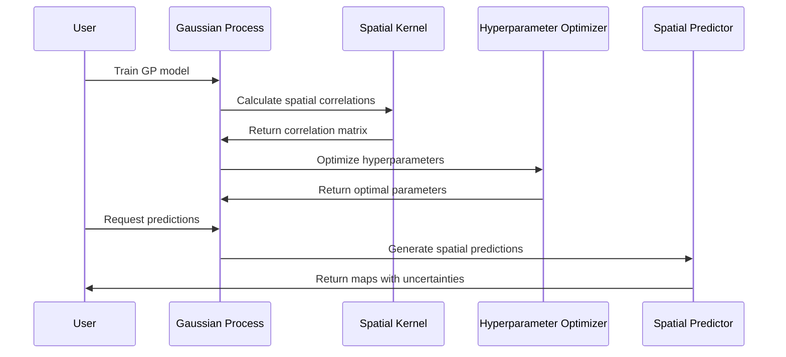

# Chapter 5: Gaussian Process Models

Now that you've learned how [Mean Function Models](04_mean_function_models___.md) create baseline soil property estimates across your study area, it's time to explore the mathematical heart of AgReFed-ML: **Gaussian Process Models**.

Think of this relationship like transforming a rough pencil sketch into a detailed oil painting. The [Mean Function Models](04_mean_function_models___.md) are like skilled sketch artists who quickly capture the main shapes and proportions of your soil landscape. But Gaussian Process Models are like master painters who take that sketch and add all the fine details, subtle transitions, and spatial relationships that make the final artwork truly realistic and beautiful.

## What Problem Do Gaussian Process Models Solve?

Imagine you're trying to create a detailed soil organic carbon map for a 1,000-hectare farm, but you only have soil measurements from 50 scattered locations. Your [Mean Function Models](04_mean_function_models___.md) have given you good baseline estimates everywhere, but you notice some problems:

- **Missing spatial patterns**: The baseline map doesn't capture the smooth transitions you'd expect between nearby locations
- **Ignores local correlations**: A high carbon measurement at one location should influence predictions at nearby locations, but the baseline model treats each prediction independently
- **Overconfident in data-sparse areas**: The baseline model gives the same confidence level in areas with many soil samples versus areas with no samples nearby
- **No spatial structure**: Real soil properties have spatial structure - they don't change randomly from meter to meter

Gaussian Process Models solve these problems by learning and modeling the **spatial relationships** in your soil data. They're like having an expert soil scientist who understands that "soil properties at nearby locations should be similar" and can make intelligent interpolations that honor this spatial structure.

## What Are Gaussian Process Models?

Think of Gaussian Process Models as sophisticated spatial interpolation engines with three key superpowers:

### 1. **Spatial Memory** - They Remember Where Things Are
Unlike simpler models that treat each location independently, GPs remember the spatial relationships. They know that if soil carbon is high at location A, it's likely to be high at nearby location B, but this influence decreases with distance.

### 2. **Honest Uncertainty** - They Know What They Don't Know  
GPs don't just give you predictions; they tell you exactly how confident they are about each prediction. In areas with many soil samples, they're very confident. In areas far from any measurements, they honestly admit high uncertainty.

### 3. **Efficient Computing** - They Handle Large Datasets Smartly
Through custom sparse kernels, GPs can work with thousands of data points efficiently, focusing computational resources where they matter most.

## Key Components of Gaussian Process Models

Every Gaussian Process Model in AgReFed-ML has four essential components:

### 1. **Kernel Functions (The Spatial Rules)**
These mathematical functions define how spatial correlation works:

```python
# The kernel says: "How similar should soil properties be 
# at two locations based on their distance?"
spatial_correlation = kernel_function(distance_between_points)
```

The kernel is like having rules that say "locations 10 meters apart should have very similar soil carbon, locations 100 meters apart should have somewhat similar soil carbon, and locations 1 kilometer apart might have quite different soil carbon."

### 2. **Hyperparameters (The Fine-Tuning Knobs)**
These control how the spatial correlation works:

```python
# Key hyperparameters that get optimized
hyperparams = {
    'amplitude': 1.5,      # How much variation to expect
    'lengthscale_xy': 100, # Horizontal correlation distance (meters)  
    'lengthscale_z': 0.2,  # Vertical correlation distance (meters)
    'noise': 0.1           # Measurement uncertainty
}
```

Think of these as the settings on a high-end camera - they determine how the GP interprets spatial relationships in your specific dataset.

### 3. **Training Process (Learning Spatial Patterns)**
The GP studies your soil sample locations to learn the spatial correlation patterns:

```python
# The GP examines all your soil samples and learns:
# "In this dataset, soil carbon stays similar for about 150 meters, 
#  then starts to vary more significantly"
trained_gp = train_gp(soil_locations, soil_measurements, environmental_data)
```

### 4. **Prediction Process (Smart Spatial Interpolation)**
Once trained, the GP can predict soil properties anywhere, incorporating both the mean function predictions and spatial relationships:

```python
# For each new location, the GP considers:
# 1. What does the mean function predict here?
# 2. What do nearby soil samples suggest?
# 3. How confident should we be given the sample locations?
predictions, uncertainties = gp.predict(new_locations)
```

## How to Use Gaussian Process Models

Let's walk through creating a sophisticated soil organic carbon map that incorporates spatial relationships. We'll build on the mean function results from the previous chapter.

### Step 1: Prepare Your Spatial Data

```python
# Your soil sample coordinates and measurements
soil_coordinates = np.array([
    [0.1, 1234.5, 5678.9],  # [depth_m, x_m, y_m]
    [0.1, 1245.2, 5690.1],
    [0.2, 1250.0, 5700.0],
    # ... more soil samples
])
```

The GP needs coordinates in 3D space: depth, x-position, and y-position. This allows it to model how soil properties vary both horizontally across the landscape and vertically with depth.

### Step 2: Set Up the Gaussian Process

```python
from GPmodel import train_predict_3D

# Define the hyperparameters (these will be optimized automatically)
gp_params = [
    1.0,   # amplitude - how much spatial variation to expect
    0.1,   # noise level - measurement uncertainty
    0.5,   # z lengthscale - vertical correlation distance  
    200.0  # xy lengthscale - horizontal correlation distance
]
```

These initial values are just starting points. The GP will automatically optimize them based on your actual soil data patterns.

### Step 3: Train the Gaussian Process

```python
# Train the GP using your soil samples and mean function residuals
residuals = soil_measurements - mean_function_predictions
```

The GP focuses on modeling the **residuals** - the differences between what the mean function predicted and what you actually measured. This two-stage approach combines the global patterns (mean function) with local spatial patterns (GP).

```python
# Train and predict with the GP
gp_predictions, gp_uncertainties, logl, gp_model = train_predict_3D(
    points3D_train=soil_coordinates,
    points3D_pred=prediction_grid_coordinates,
    Y_train=residuals,
    Ynoise_train=measurement_uncertainties,
    params_gp=gp_params
)
```

This single function call trains the GP model on your residuals and generates predictions across your entire study area.

### Step 4: Combine Mean Function and GP Predictions

```python
# Final predictions = Mean function + GP spatial corrections
final_predictions = mean_function_predictions + gp_predictions
final_uncertainties = np.sqrt(mean_uncertainties**2 + gp_uncertainties**2)
```

This gives you the best of both worlds: the broad-scale environmental patterns from the mean function, plus the fine-scale spatial patterns from the Gaussian Process.

## What Happens Under the Hood

When you run a Gaussian Process model, here's the step-by-step process that occurs behind the scenes:



Let's break this down:

### 1. **Spatial Correlation Calculation**
The GP first calculates how correlated every pair of soil sample locations should be:

```python
# For every pair of soil sample locations:
def calculate_spatial_correlation(location1, location2):
    distance = calculate_3D_distance(location1, location2)
    correlation = sparse_kernel_function(distance, lengthscales)
    return correlation
```

This creates a correlation matrix that says "sample A and sample B should have correlation of 0.8 because they're close, but sample A and sample C should have correlation of 0.1 because they're far apart."

### 2. **Hyperparameter Optimization Process**
The GP automatically finds the best hyperparameters by trying different values and seeing which ones best explain your data:

```python
def find_best_hyperparameters(soil_data):
    best_score = -infinity
    for amplitude in [0.5, 1.0, 2.0]:
        for lengthscale in [50, 100, 200, 500]:
            # Test how well these parameters explain the data
            score = calculate_marginal_likelihood(amplitude, lengthscale)
            if score > best_score:
                best_params = (amplitude, lengthscale)
                best_score = score
    return best_params
```

This process finds hyperparameters that best capture the spatial patterns in your specific soil dataset.

### 3. **Spatial Prediction Generation**
For each new location, the GP makes predictions by considering all nearby soil samples:

```python
def make_spatial_prediction(new_location, trained_gp):
    # Calculate how correlated this new location is with each soil sample
    correlations = []
    for sample_location in soil_sample_locations:
        correlation = kernel(new_location, sample_location)
        correlations.append(correlation)
    
    # Weight nearby samples more heavily than distant ones
    prediction = weighted_average(soil_measurements, correlations)
    uncertainty = calculate_prediction_uncertainty(correlations)
    
    return prediction, uncertainty
```

This ensures that predictions at each location are most influenced by nearby soil samples, with influence decreasing smoothly with distance.

## Implementation Details

The Gaussian Process models are implemented in the `GPmodel.py` file with several sophisticated components working together. Here's how the core functionality works:

### Sparse Kernel Implementation

AgReFed-ML uses custom sparse kernels that are computationally efficient for large datasets:

```python
def gpkernel_sparse_multidim(Delta, gamma):
    """
    Calculate spatial correlations using sparse RBF kernel
    Delta: distances between points in each dimension  
    gamma: lengthscale parameters for each dimension
    """
    # This kernel goes to zero beyond the lengthscale distance
    # This makes the correlation matrix sparse (lots of zeros)
    # which speeds up computation dramatically
    
    correlation = sparse_rbf_function(Delta, gamma)
    return correlation
```

The sparse kernel automatically sets correlations to zero for points beyond a certain distance, which dramatically speeds up computations without sacrificing accuracy.

### 3D Spatial Modeling

The GP models spatial relationships in all three dimensions (x, y, and depth):

```python
def train_predict_3D(points3D_train, points3D_pred, Y_train, params_gp):
    """
    Train GP in 3D space (x, y, depth)
    """
    # Calculate 3D distance matrices
    distance_matrix = calcDistanceMatrix_multidim(points3D_train)
    
    # Apply sparse kernel in 3D
    correlation_matrix = gpkernel_sparse_multidim(distance_matrix, lengthscales)
    
    # Solve for optimal predictions
    predictions = solve_gp_equations(correlation_matrix, Y_train)
    
    return predictions, uncertainties
```

This allows the GP to understand that soil samples at the same depth should be more correlated than samples at different depths, even if they're at the same horizontal location.

### Uncertainty Quantification

One of the GP's key strengths is honest uncertainty quantification:

```python
def calculate_prediction_uncertainty(correlation_matrix, new_location):
    """
    Calculate how uncertain we should be about predictions
    """
    # High uncertainty in areas far from soil samples
    # Low uncertainty in areas with many nearby samples
    
    distance_to_samples = calculate_distances(new_location, sample_locations)
    
    # Uncertainty decreases with proximity to samples
    uncertainty = base_uncertainty * spatial_uncertainty_function(distance_to_samples)
    
    return uncertainty
```

This gives you realistic uncertainty estimates that reflect the actual spatial distribution of your soil samples.

### Hyperparameter Optimization

The GP automatically optimizes its hyperparameters using the marginal likelihood:

```python
def optimize_gp_3D(points3d_train, Y_train, Ynoise_train):
    """
    Find optimal hyperparameters by maximizing marginal likelihood
    """
    # Define objective function
    def objective(params):
        amplitude, noise, z_length, xy_length = params
        
        # Calculate how well these parameters explain the data
        marginal_likelihood = calculate_likelihood(params, soil_data)
        return -marginal_likelihood  # Minimize negative likelihood
    
    # Use optimization algorithm to find best parameters
    optimal_params = minimize(objective, initial_guess, bounds=parameter_bounds)
    
    return optimal_params
```

This automatic optimization means you don't have to guess appropriate hyperparameter values - the GP finds them based on your actual data.

## Benefits for Agricultural Applications

Gaussian Process Models provide crucial capabilities that make AgReFed-ML's soil predictions highly accurate and reliable:

- **Realistic Spatial Structure**: Honors the fact that nearby soil properties should be similar
- **Honest Uncertainty**: Provides realistic confidence intervals that reflect data availability
- **Flexible Correlation**: Adapts to the specific spatial patterns in your dataset
- **Multi-dimensional**: Models relationships in space and depth simultaneously  
- **Computationally Efficient**: Sparse kernels make it practical for large datasets
- **Automatic Optimization**: Finds optimal parameters without manual tuning

## Conclusion

Gaussian Process Models transform AgReFed-ML from a simple prediction system into a sophisticated spatial modeling framework. Like master artists adding fine details and spatial relationships to a basic sketch, GPs take the baseline estimates from [Mean Function Models](04_mean_function_models___.md) and enhance them with realistic spatial structure and honest uncertainty quantification.

By learning the spatial correlation patterns specific to your soil dataset, GPs ensure that your final soil property maps have smooth, realistic transitions between locations while providing confidence intervals that accurately reflect where you have good data coverage versus where predictions are more uncertain.

These spatially-enhanced predictions become the foundation for the comprehensive uncertainty analysis covered in the next chapter. Ready to explore how AgReFed-ML quantifies and communicates the reliability of these sophisticated spatial predictions? The next chapter covers the [Uncertainty Quantification System](06_uncertainty_quantification_system.md), where you'll learn how the system helps you understand and communicate the reliability of your soil predictions to stakeholders and decision-makers.
