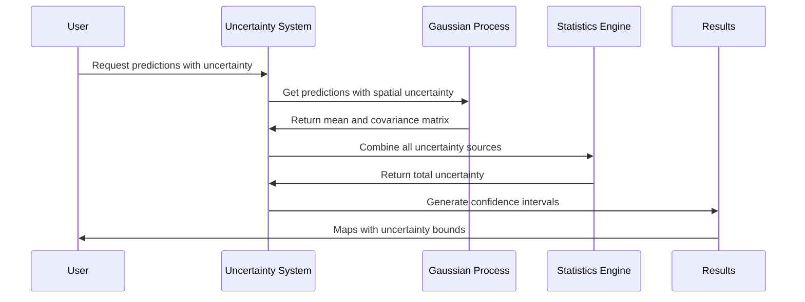

# Chapter 6: Uncertainty Quantification System

Now that you've learned how [Gaussian Process Models](05_gaussian_process_models.md) create sophisticated spatial predictions by combining baseline estimates with spatial relationships, it's time to explore one of the most crucial aspects of agricultural machine learning: **Uncertainty Quantification System**.

Think of this relationship like the difference between a basic weather app and a professional meteorological service. The [Gaussian Process Models](05_gaussian_process_models.md) are like having a sophisticated weather prediction algorithm that can forecast tomorrow's temperature. But the Uncertainty Quantification System is like having a professional meteorologist who not only tells you "it will be 25°C tomorrow" but also adds "with 90% confidence it will be between 22°C and 28°C, but there's only 60% confidence for the northern part of the region where we have fewer weather stations."

## What Problem Does the Uncertainty Quantification System Solve?

Imagine you're a farm manager making critical decisions based on a soil organic carbon map. Your AgReFed-ML system tells you that Field A has 2.5% organic carbon and Field B has 2.3% organic carbon. Based on this, you might decide to apply expensive carbon amendments to Field B.

But what if the system is actually very uncertain about Field B (maybe there were no soil samples nearby) while being very confident about Field A? Without uncertainty information, you could make costly mistakes:

- **False Confidence**: Trusting predictions in areas where the model is actually very uncertain
- **Missed Opportunities**: Being overly cautious in areas where the model is actually very confident
- **Poor Risk Management**: Not knowing where additional soil sampling would be most valuable
- **Inadequate Planning**: Making uniform management decisions when confidence varies across the field

The Uncertainty Quantification System solves these problems by providing you with **confidence intervals** for every prediction, helping you make informed decisions that account for risk and uncertainty.

## What Is the Uncertainty Quantification System?

Think of the Uncertainty Quantification System as having three specialized consultants working together to give you the complete picture:

### 1. **The Data Quality Assessor** - Measurement Uncertainty
This consultant examines your original soil measurements and says things like:
- "This soil sample was measured with high precision lab equipment (±0.1% uncertainty)"  
- "That sample came from a field kit with lower precision (±0.5% uncertainty)"

### 2. **The Model Confidence Expert** - Prediction Uncertainty  
This consultant evaluates how confident the machine learning model is about each prediction:
- "The model is very confident here because it has seen similar environmental conditions many times"
- "The model is uncertain here because this combination of elevation, slope, and rainfall is unlike anything in the training data"

### 3. **The Spatial Coverage Analyst** - Spatial Uncertainty
This consultant looks at how your soil samples are distributed and reports:
- "We have many soil samples in this area, so spatial predictions are reliable"
- "This area is far from any soil samples, so there's high spatial uncertainty"

## Key Components of Uncertainty Quantification

The Uncertainty Quantification System works with three main types of uncertainty that combine to give you complete confidence intervals:

### 1. **Measurement Uncertainty**
This comes from the inherent limitations of soil measurements:

```python
# Each soil sample has its own measurement uncertainty
soil_measurements = [2.1, 2.8, 1.9]  # Organic carbon percentages
measurement_uncertainties = [0.1, 0.3, 0.2]  # Lab precision for each sample
```

High-precision lab analysis might have ±0.1% uncertainty, while field measurements might have ±0.3% uncertainty.

### 2. **Model Uncertainty**  
This reflects how confident the machine learning model is about its predictions:

```python
# The model provides predictions with confidence intervals
mean_predictions = [2.4, 2.6, 2.1]  # Predicted organic carbon
model_uncertainties = [0.2, 0.4, 0.3]  # Model confidence for each prediction
```

The model is more confident when predicting in conditions similar to its training data.

### 3. **Spatial Uncertainty**
This accounts for how sample locations affect prediction reliability:

```python
# Predictions are more uncertain far from sample locations
distance_to_samples = [50, 200, 500]  # Meters to nearest soil sample
spatial_uncertainties = [0.1, 0.3, 0.7]  # Increases with distance
```

Predictions are most reliable near soil sample locations and become less reliable with distance.

## How to Use the Uncertainty Quantification System

Let's walk through creating soil organic carbon maps with complete uncertainty analysis. This builds on the predictions from the [Gaussian Process Models](05_gaussian_process_models.md) chapter.

### Step 1: Load Your Data with Measurement Uncertainties

```python
import numpy as np
from sigmastats import averagestats

# Your soil samples with known measurement precision
soil_data = {
    'coordinates': [[0.1, 1234.5, 5678.9], [0.1, 1245.2, 5690.1]],
    'carbon_values': [2.1, 2.8],  
    'lab_uncertainties': [0.1, 0.3]  # Different lab precision
}
```

This tells the system that your first measurement is more precise (±0.1%) than your second measurement (±0.3%).

### Step 2: Run Gaussian Process with Uncertainty Propagation

```python
from GPmodel import train_predict_3D

# Train GP model that accounts for measurement uncertainties
gp_predictions, gp_uncertainties, log_likelihood, gp_model = train_predict_3D(
    points3D_train=soil_coordinates,
    points3D_pred=prediction_grid,
    Y_train=carbon_measurements,
    Ynoise_train=lab_uncertainties,  # Include measurement precision
    params_gp=gp_parameters
)
```

The GP automatically accounts for the different precision levels of your measurements when making predictions.

### Step 3: Combine All Uncertainty Sources

```python
# Total uncertainty combines all three sources
total_uncertainty = np.sqrt(
    measurement_uncertainties**2 +    # Lab precision
    model_uncertainties**2 +          # Model confidence  
    spatial_uncertainties**2          # Distance to samples
)

# Create confidence intervals (95% confidence = 1.96 * standard deviation)
confidence_intervals = {
    'lower_95': predictions - 1.96 * total_uncertainty,
    'upper_95': predictions + 1.96 * total_uncertainty
}
```

This gives you the complete picture: not just what the model predicts, but how confident you should be about each prediction.

### Step 4: Calculate Spatial Averages with Uncertainty

```python
# Average predictions over management blocks with proper uncertainty
block_mean, block_uncertainty = averagestats(
    x=point_predictions_in_block,
    var=covariance_matrix_for_block  # Accounts for spatial correlation
)
```

When averaging predictions over larger areas (like management zones), the system properly accounts for spatial correlations between nearby predictions.

## What Happens Under the Hood

When you request predictions with uncertainty quantification, here's the step-by-step process that occurs:



Let's break this down:

### 1. **Spatial Uncertainty Calculation**
The Gaussian Process calculates how uncertainty varies across space:

```python
def calculate_spatial_uncertainty(sample_locations, prediction_locations):
    """Calculate uncertainty based on distance to samples"""
    # Closer to samples = lower uncertainty
    # Further from samples = higher uncertainty
    
    for pred_location in prediction_locations:
        distances = calculate_distances(pred_location, sample_locations)
        min_distance = np.min(distances)
        
        # Uncertainty increases with distance
        spatial_uncertainty = base_uncertainty * (1 + distance_factor * min_distance)
        
    return spatial_uncertainties
```

This ensures predictions are most confident near soil sample locations.

### 2. **Model Uncertainty Assessment**
The system evaluates how confident the model is about each prediction:

```python
def assess_model_confidence(environmental_conditions, training_data):
    """Determine model confidence based on training experience"""
    # High confidence for conditions similar to training data
    # Low confidence for unusual environmental combinations
    
    similarity_to_training = calculate_similarity(
        environmental_conditions, 
        training_data
    )
    
    model_uncertainty = base_model_uncertainty / similarity_to_training
    return model_uncertainty
```

The model is more confident when predicting in familiar environmental conditions.

### 3. **Uncertainty Propagation**
All uncertainty sources are combined using statistical rules:

```python
def combine_uncertainties(measurement_unc, model_unc, spatial_unc):
    """Combine independent uncertainty sources"""
    # For independent uncertainties, combine in quadrature
    total_uncertainty = np.sqrt(
        measurement_unc**2 + 
        model_unc**2 + 
        spatial_unc**2
    )
    return total_uncertainty
```

This mathematical combination ensures that the final uncertainty intervals are statistically correct.

## Implementation Details

The Uncertainty Quantification System is implemented across several modules that work together seamlessly. Here's how the core components work:

### Gaussian Process Uncertainty

The `GPmodel.py` file implements uncertainty quantification through the GP covariance structure:

```python
def train_predict_3D(points3D_train, points3D_pred, Y_train, Ynoise_train):
    """Train GP and return predictions with uncertainties"""
    
    # Build covariance matrix including measurement noise
    K_train = build_covariance_matrix(points3D_train, hyperparameters)
    K_train += np.diag(Ynoise_train**2)  # Add measurement uncertainties
    
    # Calculate predictive covariance
    K_pred = predict_covariance(points3D_pred, points3D_train, hyperparameters)
    
    # Uncertainty comes from predictive variance
    prediction_variance = np.diag(K_pred)
    prediction_uncertainty = np.sqrt(prediction_variance)
    
    return predictions, prediction_uncertainty
```

The GP naturally provides uncertainty estimates based on the covariance structure and distance to training points.

### Statistical Uncertainty Combination

The `sigmastats.py` file provides functions for properly combining uncertainties:

```python
def averagestats(x, var):
    """Compute weighted mean and uncertainty for correlated measurements"""
    
    if var.shape == (len(x), len(x)):  # Full covariance matrix
        # Account for spatial correlations
        inv_cov = np.linalg.inv(var)
        weights = np.sum(inv_cov, axis=1) / np.sum(inv_cov)
        
        # Weighted average with correlation-aware uncertainty
        weighted_mean = np.sum(weights * x)
        weighted_variance = calculate_correlated_variance(weights, var)
        
    else:  # Independent uncertainties  
        # Simple weighted average for uncorrelated data
        weights = 1.0 / var
        weighted_mean = np.sum(weights * x) / np.sum(weights)
        weighted_variance = 1.0 / np.sum(weights)
    
    return weighted_mean, np.sqrt(weighted_variance)
```

This function properly handles both independent uncertainties and spatially correlated uncertainties.

### Measurement Uncertainty Integration

The system seamlessly integrates measurement uncertainties throughout the modeling pipeline:

```python
def integrate_measurement_uncertainty(predictions, model_uncertainty, measurement_noise):
    """Add measurement uncertainty to model predictions"""
    
    # For locations with direct measurements, include lab precision
    total_uncertainty = np.sqrt(
        model_uncertainty**2 + measurement_noise**2
    )
    
    # For interpolated locations, measurement uncertainty affects nearby predictions
    interpolated_measurement_effect = propagate_measurement_uncertainty(
        measurement_locations, prediction_locations, measurement_noise
    )
    
    total_uncertainty = np.sqrt(
        model_uncertainty**2 + interpolated_measurement_effect**2
    )
    
    return predictions, total_uncertainty
```

This ensures that the precision of your original soil measurements affects the final uncertainty estimates appropriately.

### Confidence Interval Calculation

The system provides multiple confidence level options:

```python
def calculate_confidence_intervals(predictions, uncertainties, confidence_levels):
    """Calculate confidence intervals for different probability levels"""
    
    # Standard confidence multipliers (assuming normal distribution)
    multipliers = {
        '68%': 1.00,  # ±1 standard deviation
        '90%': 1.64,  # ±1.64 standard deviations  
        '95%': 1.96,  # ±1.96 standard deviations
        '99%': 2.58   # ±2.58 standard deviations
    }
    
    intervals = {}
    for level in confidence_levels:
        mult = multipliers[level]
        intervals[f'lower_{level}'] = predictions - mult * uncertainties
        intervals[f'upper_{level}'] = predictions + mult * uncertainties
        
    return intervals
```

This provides you with flexibility in choosing appropriate confidence levels for your specific decision-making needs.

## Benefits for Agricultural Decision Making

The Uncertainty Quantification System transforms soil predictions from simple point estimates into comprehensive risk assessments:

- **Informed Decision Making**: Know which areas need additional sampling before making expensive management decisions
- **Risk-Aware Planning**: Account for prediction uncertainty when planning treatments or investments
- **Adaptive Sampling**: Identify areas where additional soil samples would most improve prediction accuracy
- **Stakeholder Communication**: Provide honest assessments of prediction reliability to farmers and advisors
- **Regulatory Compliance**: Meet requirements for uncertainty reporting in carbon accounting and environmental assessments

## Conclusion

The Uncertainty Quantification System is what transforms AgReFed-ML from a simple prediction tool into a professional decision-support system. Like having a expert consultant who not only gives you recommendations but also honestly assesses the confidence behind each recommendation, the system ensures you always know not just what the model predicts, but how much you should trust those predictions.

By combining measurement uncertainties from your soil samples, model uncertainties from the machine learning algorithms, and spatial uncertainties based on sample coverage, the system provides comprehensive confidence intervals that enable risk-aware agricultural decision making.

These uncertainty-aware predictions become the foundation for more sophisticated spatial-temporal modeling covered in the next chapter. Ready to explore how AgReFed-ML handles predictions that vary across both space and time while maintaining accurate uncertainty estimates? The next chapter covers the [Spatial-Temporal Modeling Framework](07_spatial_temporal_modeling_framework.md), where you'll learn how the system models soil properties that change across landscapes and through time.
