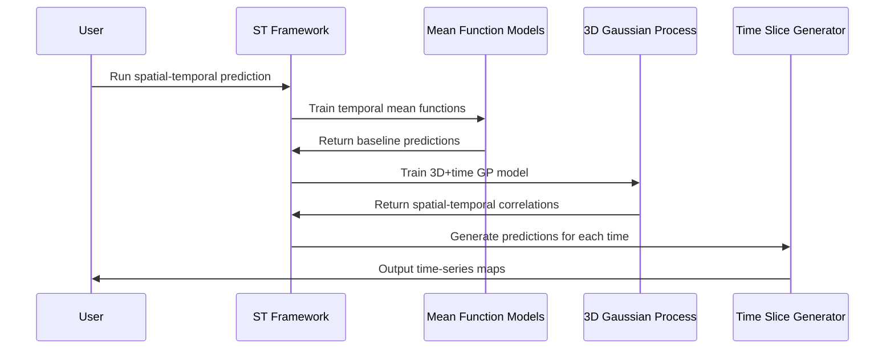

# Chapter 7: Spatial-Temporal Modeling Framework

Now that you've learned how the [Uncertainty Quantification System](06_uncertainty_quantification_system.md) provides comprehensive confidence intervals for your soil predictions, it's time to explore AgReFed-ML's most sophisticated capability: the **Spatial-Temporal Modeling Framework**.

Think of this relationship like the difference between taking a single photograph and creating a time-lapse movie. The [Uncertainty Quantification System](06_uncertainty_quantification_system.md) is like having a professional photographer who can take an excellent snapshot of your field with honest assessments of image quality. But the Spatial-Temporal Modeling Framework is like having a filmmaker who can create a smooth, detailed time-lapse movie showing how your field changes throughout an entire growing season - complete with confidence intervals for every frame.

## What Problem Does the Spatial-Temporal Modeling Framework Solve?

Imagine you're managing irrigation for a 500-hectare farm during a critical growing season. You need to make weekly decisions about where and when to irrigate, but soil moisture changes constantly based on:

- **Weather patterns**: Rainfall events, drought periods, temperature fluctuations
- **Crop growth**: Root development changes water uptake patterns over time
- **Seasonal cycles**: Spring snowmelt, summer heat, autumn harvest
- **Spatial variation**: Different soil types, slopes, and microclimates across your farm

With previous modeling approaches, you'd face these limitations:

- **Static snapshots**: Models that predict soil moisture for only one point in time
- **Temporal blindness**: Missing the smooth transitions and seasonal patterns 
- **Disconnected predictions**: No understanding of how this week's moisture relates to next week's
- **Poor interpolation**: Unrealistic jumps between weekly measurements

The Spatial-Temporal Modeling Framework solves these problems by modeling soil properties as they naturally exist: **continuously varying across both space and time simultaneously**. It's like having a sophisticated weather forecasting system specifically designed for soil properties.

## What Is the Spatial-Temporal Modeling Framework?

Think of the Spatial-Temporal Modeling Framework as a smart 4D mapping system (3D space + time) that understands three fundamental principles:

### 1. **Spatial Correlation** - "Nearby Places Are Similar"
Locations close to each other should have similar soil properties, just like neighboring pixels in a photograph should have similar colors.

### 2. **Temporal Correlation** - "Nearby Times Are Similar" 
Soil conditions this week should be similar to conditions next week, just like consecutive frames in a movie should look similar.

### 3. **Spatial-Temporal Correlation** - "The Whole Story Matters"
The framework understands that a location with high soil moisture today will influence moisture patterns at nearby locations over the coming weeks.

## Key Components of the Spatial-Temporal Framework

The framework has three essential components working together:

### 1. **3D Kernel Functions (The Spatial-Temporal Rules)**
These mathematical functions define how correlation works across all dimensions:

```python
# The kernel considers three dimensions simultaneously:
correlation = spatial_temporal_kernel(
    distance_xy,    # How far apart in space (meters)
    distance_z,     # How far apart in depth (meters) 
    distance_time   # How far apart in time (days/months)
)
```

This kernel might say: "locations 100 meters apart and 7 days apart should have correlation of 0.8, but locations 1 kilometer apart and 30 days apart should have correlation of 0.2."

### 2. **Temporal Coordinate System (Time as a Dimension)**
Time is treated as a coordinate just like x, y, and depth:

```python
# Each measurement has 4 coordinates
sample_location = {
    'x': 1234.5,        # Easting (meters)
    'y': 5678.9,        # Northing (meters)  
    'depth': 0.1,       # Depth (meters)
    'time': 150         # Days after planting
}
```

### 3. **Continuous Prediction Surface (The 4D Map)**
The framework generates smooth predictions across all four dimensions:

```python
# Predict soil moisture for any location and any time
prediction = predict_spatial_temporal(
    location=[1250.0, 5700.0, 0.1],  # x, y, depth
    time_points=[50, 100, 150, 200]  # Multiple time points
)
```

## How to Use the Spatial-Temporal Modeling Framework

Let's walk through creating a soil moisture monitoring system for a growing season. This will show you how to predict soil moisture at any location and any time across your farm.

### Step 1: Configure Your Temporal Analysis

```python
# Settings for soil moisture monitoring across growing season
settings = {
    'model_function': 'rf-gp',           # Random Forest + Gaussian Process
    'name_target': 'soil_moisture',      # What we're predicting
    'colname_tcoord': 'days_after_planting',  # Time coordinate column
    'tmin': 0,                           # Start of growing season
    'tmax': 180,                         # End of growing season  
    'list_t_pred': [30, 60, 90, 120, 150]  # Key time points to predict
}
```

This tells the framework you want to predict soil moisture at 30-day intervals throughout a 180-day growing season.

### Step 2: Run the Spatial-Temporal Workflow

```python
from soilmod_predict_st import main

# Run the complete spatial-temporal analysis
main('settings_moisture_timeseries.yaml')
```

This single command runs the entire framework, generating soil moisture maps for each time point with full uncertainty quantification.

### Step 3: Examine Your Time-Series Maps

The framework automatically creates:
- **Individual time-slice maps**: Soil moisture predictions for each time point
- **Animation sequences**: Time-lapse visualization of moisture changes
- **Uncertainty evolution**: How prediction confidence changes over time

```python
# The framework generates these outputs automatically:
# - Pred_soil_moisture_t030.tif  (Day 30 predictions)
# - Pred_soil_moisture_t060.tif  (Day 60 predictions)
# - Pred_soil_moisture_t090.tif  (Day 90 predictions)
# - Std_soil_moisture_t030.tif   (Day 30 uncertainties)
# - ... and so on for all time points
```

## What Happens Under the Hood

When you run the Spatial-Temporal Modeling Framework, here's the step-by-step process that occurs behind the scenes:



Let's break this down:

### 1. **Temporal Coordinate Processing**
The framework first converts your time information into a coordinate system:

```python
# Convert time measurements to coordinates
def process_temporal_coordinates(data):
    # Time becomes the 'z' coordinate in 3D space
    data['z'] = data['days_after_planting']  
    
    # Create 3D points: [time, y_position, x_position]
    points_3D = np.array([
        data['z'].values,     # Time dimension
        data['y'].values,     # Spatial Y dimension  
        data['x'].values      # Spatial X dimension
    ]).T
    
    return points_3D
```

This allows the GP model to treat time as a spatial dimension and learn temporal correlations.

### 2. **Mean Function Training Across Time**
The framework trains [Mean Function Models](04_mean_function_models___.html) that understand temporal patterns:

```python
# Add temporal features to environmental covariates
temporal_features = base_features + ['days_after_planting']

# Train Random Forest that learns seasonal patterns
rf_model = train_temporal_model(
    X=environmental_data_plus_time,
    y=soil_moisture_measurements,
    features=temporal_features
)
```

This captures broad seasonal trends like "soil moisture decreases through summer and increases in fall."

### 3. **3D Gaussian Process Training**
The framework trains a 3D Gaussian Process that learns spatial-temporal correlations:

```python
# Train GP with 3D kernel (x, y, time)
gp_model = train_3D_GP(
    coordinates_3D=sample_locations_with_time,
    residuals=measurements_minus_mean_function,
    kernel_lengthscales=[
        time_correlation_days,    # How long temporal correlation lasts
        spatial_correlation_xy,   # How far spatial correlation extends
        depth_correlation_z       # How deep vertical correlation goes
    ]
)
```

This learns patterns like "high moisture at location A on day 50 suggests high moisture at nearby locations on days 48-52."

### 4. **Time Slice Prediction Generation**
For each time point you specified, the framework generates complete spatial maps:

```python
def predict_time_slice(time_point):
    # Get environmental conditions for all locations at this time
    environmental_grid_t = get_environmental_data(time=time_point)
    
    # Predict with mean function
    mean_predictions_t = rf_model.predict(environmental_grid_t)
    
    # Add spatial-temporal GP corrections
    gp_corrections_t = gp_model.predict_at_time(time=time_point)
    
    # Combine for final predictions
    final_predictions_t = mean_predictions_t + gp_corrections_t
    
    return final_predictions_t, uncertainties_t
```

This process creates smooth, realistic transitions between time points while honoring your actual measurements.

## Implementation Details

The Spatial-Temporal Modeling Framework is implemented in `soilmod_predict_st.py` with several sophisticated components working together:

### Temporal Settings Processing

The framework converts temporal settings to spatial-temporal coordinates:

```python
def preprocess_settings(fname_settings):
    """Convert temporal settings to 3D spatial settings"""
    # Map temporal coordinates to z-coordinates for 3D processing
    settings.colname_zcoord = settings.colname_tcoord  # Time becomes 'z'
    settings.zmin = settings.tmin                      # Time minimum
    settings.zmax = settings.tmax                      # Time maximum  
    settings.list_z_pred = settings.list_t_pred        # Prediction times
    
    return settings
```

This allows the framework to reuse all the 3D Gaussian Process machinery for spatial-temporal analysis.

### Temporal Correlation Modeling

The framework uses the same 3D sparse kernels from the [Gaussian Process Models](05_gaussian_process_models.md) chapter, but applies them to spatial-temporal distances:

```python
# 3D distance calculation includes temporal separation
points3D_train = np.array([
    temporal_coordinates,  # Days after planting
    y_coordinates,        # Northing positions
    x_coordinates         # Easting positions  
]).T

# GP kernel calculates correlations in space-time
correlations = gpkernel_sparse_multidim(
    distance_matrix_3D, 
    lengthscales=[time_scale, spatial_scale_y, spatial_scale_x]
)
```

This creates correlation patterns that honor both spatial and temporal relationships simultaneously.

### Time Slice Iteration

The framework generates predictions by iterating through your specified time points:

```python
# Generate predictions for each time slice
for time_point in settings.list_t_pred:
    print(f'Computing predictions for time: {time_point}')
    
    # Select grid data for this time point
    grid_at_time = covariate_grid[covariate_grid.time == time_point]
    
    # Train/predict with spatial-temporal model
    predictions, uncertainties = predict_spatial_temporal(
        training_data=soil_samples_all_times,
        prediction_grid=grid_at_time,
        time_point=time_point
    )
    
    # Save results as time-specific maps
    save_time_slice_maps(predictions, uncertainties, time_point)
```

This creates a complete set of maps showing how soil properties evolve over time.

### Uncertainty Evolution Tracking

The framework tracks how uncertainty changes over time:

```python
def calculate_temporal_uncertainty(distance_to_samples_in_time):
    """Calculate uncertainty based on temporal distance to measurements"""
    
    # Uncertainty increases with temporal distance from measurements
    temporal_uncertainty = base_uncertainty * (
        1 + temporal_decay_factor * min_time_distance
    )
    
    return temporal_uncertainty
```

This ensures that predictions far from measurement times have appropriately higher uncertainty.

## Benefits for Agricultural Applications

The Spatial-Temporal Modeling Framework provides essential capabilities for time-sensitive agricultural management:

- **Dynamic Management**: Make informed decisions about irrigation, fertilization, and pest control based on how conditions are changing
- **Seasonal Planning**: Understand long-term trends and plan management activities accordingly
- **Risk Assessment**: Identify periods when soil conditions may be problematic and plan mitigation strategies
- **Resource Optimization**: Time inputs like irrigation and fertilizer application for maximum efficiency
- **Monitoring Programs**: Design sampling strategies that account for how soil properties change over time

## Conclusion

The Spatial-Temporal Modeling Framework represents the pinnacle of AgReFed-ML's predictive capabilities. Like having a sophisticated 4D weather forecasting system for soil properties, it enables you to understand and predict how soil conditions vary across your landscape and through time.

By combining the baseline predictions from [Mean Function Models](04_mean_function_models___.html), the spatial sophistication of [Gaussian Process Models](05_gaussian_process_models.md), and the uncertainty awareness of the [Uncertainty Quantification System](06_uncertainty_quantification_system.md), the framework creates smooth, realistic time-series predictions that honor both the spatial structure of your landscape and the temporal dynamics of agricultural systems.

These dynamic, uncertainty-aware predictions become the foundation for generating realistic training datasets and testing scenarios. Ready to explore how AgReFed-ML can create synthetic soil data that captures all these spatial-temporal relationships? The next chapter covers [Synthetic Data Generation](08_synthetic_data_generation.md), where you'll learn how the system can generate realistic soil datasets for testing models, filling data gaps, and training machine learning algorithms.

---
