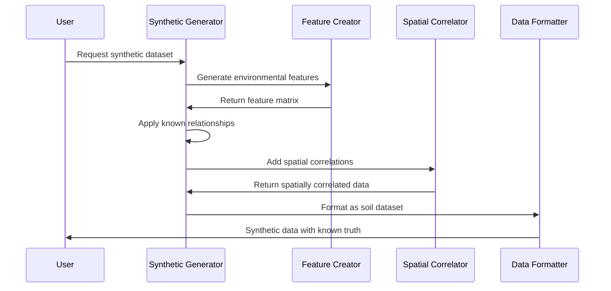

# Chapter 8: Synthetic Data Generation

Now that you've learned how the [Spatial-Temporal Modeling Framework](07_spatial_temporal_modeling_framework.md) creates sophisticated 4D predictions that vary across space and time, you're ready to explore a crucial component for testing and validating these complex models: **Synthetic Data Generation**.

Think of this relationship like the difference between test-driving a car on public roads versus training in a professional driving simulator. The [Spatial-Temporal Modeling Framework](07_spatial_temporal_modeling_framework.md) is like having a sophisticated sports car with advanced features - GPS navigation, adaptive cruise control, and terrain-sensing suspension. But before you take that car onto challenging mountain roads with real consequences, you want to test all its systems in a controlled environment where you know exactly what should happen. That's what Synthetic Data Generation provides: a professional testing laboratory for your soil models.

## What Problem Does Synthetic Data Generation Solve?

Imagine you've just developed a sophisticated soil organic carbon model using all the techniques from previous chapters - [Mean Function Models](04_mean_function_models___.html), [Gaussian Process Models](05_gaussian_process_models.md), and [Spatial-Temporal Modeling Framework](07_spatial_temporal_modeling_framework.md). Now you need to answer critical questions:

- **Is my model working correctly?** How do you know if your 2.3% carbon prediction is accurate when you don't know the true value?
- **Where does my model fail?** Which environmental conditions or spatial patterns cause poor predictions?
- **How much data do I need?** Would 100 soil samples give much better results than 50 samples?
- **Which features matter most?** Are elevation and rainfall really the most important predictors?

Without synthetic data, you face these challenges:
- **Unknown ground truth**: You never know the "correct" answer to compare against
- **Limited test scenarios**: Real data only covers the conditions that happened to occur
- **Expensive experimentation**: Testing different sampling strategies requires expensive field work
- **Unclear model behavior**: No way to isolate and test specific model components

Synthetic Data Generation solves these problems by creating **artificial soil datasets with known properties**. It's like having a flight simulator where you can create any weather condition, terrain type, or emergency scenario to test how your "pilot" (model) performs when you know exactly what the right response should be.

## What Is Synthetic Data Generation?

Think of Synthetic Data Generation as a sophisticated laboratory that can create realistic but artificial soil datasets. This laboratory has three main capabilities:

### 1. **The Recipe Designer** - Known Relationships
The system lets you specify exactly how soil properties relate to environmental factors:
- "Soil carbon increases by 0.2% for every 100m of elevation gain"  
- "High rainfall and moderate slope create optimal carbon conditions"
- "Spatial correlation extends 200 meters before properties become independent"

### 2. **The Landscape Generator** - Realistic Spatial Patterns  
The system creates artificial landscapes with controllable characteristics:
- Random scattered sampling points (like real field sampling)
- Regular grid patterns (like drone or satellite data)
- Any geographic extent and coordinate system you need

### 3. **The Complexity Controller** - Adjustable Difficulty
The system lets you control how challenging the synthetic data is:
- Simple linear relationships vs. complex interactions
- Low measurement noise vs. realistic field measurement uncertainty
- Strong spatial patterns vs. highly variable conditions

## Key Components of Synthetic Data Generation

Every synthetic dataset created by AgReFed-ML has four essential components:

### 1. **Environmental Features (The Landscape)**
These are the artificial environmental conditions that serve as predictors:

```python
# Create synthetic environmental features
features = [
    'elevation',     # Artificial elevation values
    'slope',        # Simulated slope values  
    'rainfall',     # Generated precipitation data
    'temperature'   # Synthetic temperature values
]
```

These features are mathematically generated but designed to behave like real environmental data.

### 2. **Known Relationships (The Rules)**
You specify exactly how environmental features relate to soil properties:

```python
# Define the true relationships (what your model should learn)
true_coefficients = {
    'elevation': 0.002,    # +0.2% carbon per 100m elevation
    'rainfall': 0.001,     # +0.1% carbon per 100mm rainfall
    'slope': -0.05,        # -0.05% carbon per degree slope
    'temperature': -0.01   # -0.01% carbon per degree temperature
}
```

These coefficients define the "ground truth" that your trained models should discover.

### 3. **Spatial Patterns (The Neighborhood Effects)**
You can add realistic spatial correlations:

```python
# Add spatial correlation (nearby locations are similar)
spatial_settings = {
    'correlation_length': 200,  # Correlation extends 200 meters
    'correlation_strength': 0.3 # 30% of variation is spatial
}
```

This makes the synthetic data behave like real soil data, where nearby locations tend to have similar properties.

### 4. **Measurement Noise (The Reality Factor)**
Add realistic uncertainty to mimic real-world measurement limitations:

```python
# Add realistic measurement uncertainty
noise_level = 0.1  # 10% random measurement error
```

This ensures your synthetic data includes the same kind of variability you'd see in real soil measurements.

## How to Use Synthetic Data Generation

Let's walk through creating a synthetic soil organic carbon dataset to test your modeling pipeline. We'll create data with known relationships, then see if your models can discover those relationships.

### Step 1: Configure Your Synthetic Dataset

```python
# Settings for synthetic soil carbon data
settings = {
    'n_features': 6,                    # Number of environmental variables
    'n_informative_features': 4,        # How many actually matter
    'n_samples': 200,                   # Number of soil sample locations
    'model_order': 'quadratic',         # Include feature interactions
    'spatial_correlation': True         # Add realistic spatial patterns
}
```

This creates a dataset with 6 environmental features where 4 actually influence soil carbon, using 200 sample locations with quadratic relationships and spatial correlation.

### Step 2: Set Spatial and Environmental Parameters

```python
# Define the synthetic landscape
landscape_settings = {
    'spatial_size': 1000,              # 1km x 1km study area
    'center': [500000, 4000000],       # UTM coordinates of center
    'coordinate_system': 'EPSG:32633', # UTM Zone 33N
    'sampling_pattern': 'random'       # Random sample locations
}
```

This creates a 1-kilometer square study area with randomly distributed soil sample locations.

### Step 3: Control the Complexity and Noise

```python
# Set difficulty and realism levels
complexity_settings = {
    'noise_level': 0.15,               # 15% measurement uncertainty
    'correlation_length': 150,         # Spatial correlation extends 150m  
    'correlation_amplitude': 0.2       # 20% of variation is spatial
}
```

This adds realistic measurement uncertainty and spatial patterns that extend about 150 meters.

### Step 4: Generate the Synthetic Dataset

```python
from synthgen import gen_synthetic

# Create synthetic soil carbon data with known properties
synthetic_data, true_coefficients, feature_names = gen_synthetic(
    n_features=6,
    n_samples=200,
    model_order='quadratic',
    noise=0.15,
    corr_length=150,
    corr_amp=0.2,
    spatialsize=1000
)
```

This single function call creates a complete synthetic dataset with environmental features, soil carbon values, and spatial coordinates.

### Step 5: Test Your Models Against Known Truth

Now you can test whether your modeling pipeline can recover the known relationships:

```python
# Train your model on synthetic data
from soilmod_predict import main

# Use the same prediction workflow as with real data  
main('settings_synthetic_test.yaml')

# Compare model predictions to known true values
model_accuracy = compare_predictions_to_truth(
    predictions=model_results,
    true_values=synthetic_data['true_carbon']
)
```

Since you know the true relationships, you can measure exactly how well your model performs.

## What Happens Under the Hood

When you generate synthetic data, here's the step-by-step process that occurs behind the scenes:



Let's break this down:

### 1. **Environmental Feature Generation**
The system first creates realistic environmental features:

```python
# Generate environmental features that behave like real data
def create_environmental_features(n_samples, n_features):
    # Create features with realistic ranges and correlations
    features = generate_realistic_features(
        n_samples=n_samples,
        feature_types=['elevation', 'slope', 'rainfall', 'temperature']
    )
    
    # Normalize features to standard ranges
    normalized_features = scale_to_realistic_ranges(features)
    
    return normalized_features
```

This creates environmental data that has the same statistical properties as real environmental data.

### 2. **Relationship Application**
The system applies your specified relationships to create soil property values:

```python
# Apply known relationships to generate soil properties
def apply_known_relationships(features, coefficients, model_order):
    if model_order == 'linear':
        # Simple linear relationships
        soil_values = features @ coefficients
        
    elif model_order == 'quadratic':
        # Include feature interactions  
        interactions = create_feature_interactions(features)
        extended_features = combine(features, interactions)
        soil_values = extended_features @ extended_coefficients
        
    return soil_values
```

This step creates soil property values using exactly the relationships you specified.

### 3. **Spatial Correlation Addition**
The system adds realistic spatial patterns:

```python
# Add spatial correlation between nearby locations
def add_spatial_correlation(soil_values, coordinates, correlation_params):
    # Calculate distances between all sample locations
    distance_matrix = calculate_distances(coordinates)
    
    # Create spatial correlation kernel
    correlation_kernel = exponential_kernel(
        distances=distance_matrix,
        length_scale=correlation_params['length'],
        amplitude=correlation_params['amplitude']
    )
    
    # Apply spatial smoothing
    spatially_correlated = apply_kernel(soil_values, correlation_kernel)
    
    return spatially_correlated
```

This makes nearby locations have similar soil values, just like real soil data.

### 4. **Noise Addition and Final Formatting**
Finally, the system adds measurement uncertainty and formats the output:

```python
# Add realistic measurement noise
def add_measurement_noise(clean_values, noise_level):
    noise = generate_random_noise(
        size=len(clean_values),
        standard_deviation=noise_level
    )
    
    noisy_values = clean_values + noise
    return noisy_values

# Format as standard soil dataset
def format_as_soil_dataset(features, soil_values, coordinates):
    # Combine everything into a standard data format
    dataset = create_dataframe(
        environmental_features=features,
        soil_measurements=soil_values,
        spatial_coordinates=coordinates
    )
    return dataset
```

This creates a synthetic dataset that looks exactly like real soil data but with known ground truth.

## Implementation Details

The Synthetic Data Generation system is implemented in the `synthgen.py` file with several sophisticated components working together. Here's how the core functionality works:

### Main Generation Function

The `gen_synthetic()` function orchestrates the entire process:

```python
def gen_synthetic(n_features, n_informative_features=10, n_samples=200,
                 model_order='quadratic', correlated=False, noise=0.1,
                 corr_length=10, corr_amp=0.2, spatialsize=100):
    """Generate synthetic soil datasets with known properties"""
    
    # Generate base regression features
    X_features, y_values, true_coefficients = make_regression(
        n_samples=n_samples,
        n_features=n_features,
        n_informative=n_informative_features,
        noise=noise,
        random_state=42
    )
    
    return synthetic_dataset, true_coefficients, feature_names
```

This uses scikit-learn's regression data generator as a foundation, then adds soil-specific enhancements.

### Spatial Correlation Implementation

The system adds realistic spatial patterns using exponential kernels:

```python
def create_kernel_expsquared(distance_matrix, gamma):
    """Create exponential squared kernel for spatial correlation"""
    # Spatial correlation decreases exponentially with distance
    return np.exp(-distance_matrix**2 / (2 * gamma**2))

# Apply spatial correlation to soil values
if (corr_amp > 0) & (corr_length > 0):
    distances = calculate_pairwise_distances(coordinates)
    spatial_kernel = create_kernel_expsquared(distances, corr_length)
    
    # Add spatially correlated component
    spatial_component = spatial_kernel @ base_soil_values
    final_soil_values = base_soil_values + corr_amp * spatial_component
```

This creates realistic spatial patterns where nearby locations have similar soil properties.

### Flexible Model Complexity

The system supports different relationship complexities:

```python
# Linear relationships: y = a₁×x₁ + a₂×x₂ + ...
if model_order == 'linear':
    soil_values = features @ coefficients

# Quadratic relationships: includes x₁×x₂, x₁², etc.
elif model_order == 'quadratic':
    # Add all pairwise interactions
    interactions = []
    for i, j in itertools.combinations(features.T, 2):
        interactions.append(i * j)
    
    # Add squared terms  
    squared_terms = features**2
    
    # Combine all terms
    extended_features = np.hstack([features, interactions, squared_terms])
    soil_values = extended_features @ extended_coefficients
```

This allows you to test models against different levels of complexity.

### Grid and Random Sampling

The system supports both regular grids and random sampling patterns:

```python
def create_sample_locations(n_samples, spatial_size, pattern='random'):
    """Create spatial coordinates for synthetic samples"""
    
    if pattern == 'grid':
        # Regular grid pattern
        grid_size = int(np.sqrt(n_samples))
        x, y = np.meshgrid(
            np.linspace(-spatial_size/2, spatial_size/2, grid_size),
            np.linspace(-spatial_size/2, spatial_size/2, grid_size)
        )
        coordinates = np.column_stack([x.flatten(), y.flatten()])
        
    elif pattern == 'random':
        # Random scattered points
        coordinates = np.random.uniform(
            -spatial_size/2, spatial_size/2, 
            (n_samples, 2)
        )
    
    return coordinates
```

This flexibility lets you test how sampling patterns affect model performance.

## Benefits for Model Development and Testing

Synthetic Data Generation provides essential capabilities for developing robust soil models:

- **Ground Truth Validation**: Know exactly how well your models perform because you know the correct answers
- **Controlled Experiments**: Test specific scenarios (sparse sampling, high noise, complex relationships) systematically  
- **Feature Importance Verification**: Confirm that your models identify the truly important environmental factors
- **Sampling Strategy Optimization**: Test different numbers and patterns of soil samples before expensive field work
- **Model Comparison**: Compare different modeling approaches on identical, controlled datasets
- **Edge Case Testing**: Create challenging scenarios that might not exist in your real data

## Conclusion

Synthetic Data Generation transforms model development from educated guesswork into rigorous scientific testing. Like having a professional flight simulator for training pilots, it provides a controlled environment where you can test every aspect of your soil modeling pipeline with complete knowledge of what the correct results should be.

By creating artificial datasets with known relationships, realistic spatial patterns, and controllable complexity, the system enables systematic testing and validation of all the sophisticated techniques you've learned: [Mean Function Models](04_mean_function_models___.html), [Gaussian Process Models](05_gaussian_process_models.md), [Uncertainty Quantification](06_uncertainty_quantification_system.md), and [Spatial-Temporal Modeling](07_spatial_temporal_modeling_framework.md).

These rigorously tested models become the foundation for comprehensive performance evaluation on real data. Ready to explore how AgReFed-ML systematically evaluates model accuracy and reliability? The next chapter covers [Model Evaluation and Cross-Validation](09_model_evaluation_and_cross_validation.md), where you'll learn how the system provides honest assessments of model performance and helps you choose the best approaches for your specific agricultural applications.

---
