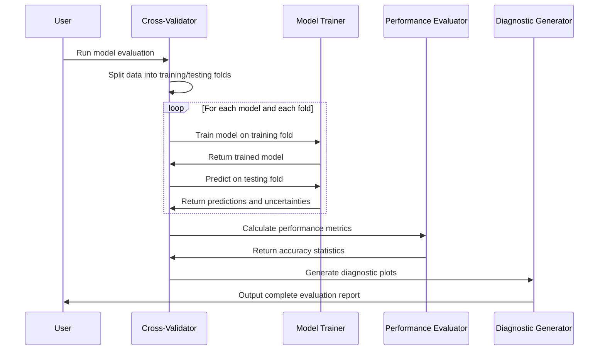

# Chapter 9: Model Evaluation and Cross-Validation

Now that you've learned how [Synthetic Data Generation](08_synthetic_data_generation.md) creates controlled testing environments with known ground truth, it's time to explore the final crucial piece of the AgReFed-ML puzzle: **Model Evaluation and Cross-Validation**.

Think of this relationship like the difference between practicing for your driver's license in a simulator versus taking the actual road test. [Synthetic Data Generation](08_synthetic_data_generation.md) is like having a professional driving simulator where you can practice parallel parking, highway merging, and emergency braking in a safe environment where you know exactly what should happen. But Model Evaluation and Cross-Validation is like having a certified driving instructor who gives you the actual road test - using your real soil data to provide honest, rigorous assessments of whether your models are ready for real-world agricultural applications.

## What Problem Does Model Evaluation and Cross-Validation Solve?

Imagine you've spent months developing a sophisticated soil organic carbon model using all the techniques from previous chapters. You've trained [Mean Function Models](04_mean_function_models___.html), added [Gaussian Process Models](05_gaussian_process_models.md), incorporated [Uncertainty Quantification](06_uncertainty_quantification_system.md), and even tested with [Synthetic Data](08_synthetic_data_generation.md). Now you need to answer the most important question of all:

**"How good is my model really, and can I trust it to make expensive agricultural decisions?"**

Without proper evaluation, you face these critical problems:

- **Overfitting blindness**: Your model might memorize your training data but fail completely on new soil samples
- **False confidence**: You might think your model is excellent when it's actually terrible at real predictions
- **Model selection confusion**: With multiple modeling approaches available, which one actually works best for your data?
- **Spatial bias**: Your model might work well in one part of your field but poorly in another
- **Uncertainty validation**: Are those confidence intervals actually meaningful, or just mathematical decoration?

Model Evaluation and Cross-Validation solves these problems by implementing a **rigorous testing protocol** that gives you honest, unbiased assessments of model performance using only your real soil data.

## What Is Model Evaluation and Cross-Validation?

Think of Model Evaluation and Cross-Validation as having three expert judges working together to evaluate your soil models:

### 1. **The Fair Test Administrator** - Cross-Validation
This judge ensures every test is completely fair by never letting your model see the "answer key" during training. Like a teacher who keeps the final exam questions secret until test day, cross-validation hides some of your soil samples during training, then tests how well the model predicts those hidden samples.

### 2. **The Statistical Scorekeeper** - Performance Metrics
This judge calculates precise, standardized scores that let you compare different models objectively. Just like Olympic judges who score gymnastic routines using standardized criteria, this system calculates metrics like accuracy (RMSE), correlation (R²), and reliability (uncertainty calibration).

### 3. **The Diagnostic Specialist** - Residual Analysis
This judge examines exactly where and why your model makes mistakes. Like a medical doctor who doesn't just say "you're sick" but diagnoses the specific problem and suggests treatment, this system creates diagnostic plots that show spatial patterns in errors, uncertainty calibration, and model reliability.

## Key Components of Model Evaluation and Cross-Validation

The evaluation system has four essential components working together:

### 1. **Spatial Cross-Validation (The Fair Testing Protocol)**
This ensures your model is tested properly by accounting for the spatial nature of soil data:

```python
# Split data into 5 folds, keeping nearby samples together
settings = {
    'nfold': 5,                    # 5-fold cross-validation  
    'axistype': 'vertical',        # Depth-based analysis
    'model_functions': ['rf-gp']   # Test Random Forest + GP
}
```

Unlike random splitting, spatial cross-validation ensures that soil samples from the same location don't end up in both training and testing sets.

### 2. **Performance Metrics (The Scorecards)**
Multiple standardized measures evaluate different aspects of model performance:

```python
# Key metrics calculated automatically:
metrics = {
    'RMSE': 0.23,      # Root Mean Square Error (lower is better)
    'nRMSE': 0.15,     # Normalized RMSE (accounts for data scale)
    'R2': 0.78,        # R-squared correlation (higher is better)
    'Theta': 1.02      # Uncertainty calibration (should be ~1.0)
}
```

These metrics give you a complete picture of accuracy, correlation, and uncertainty reliability.

### 3. **Diagnostic Visualizations (The Error Analysis)**
Automatic generation of diagnostic plots that reveal model strengths and weaknesses:

```python
# Diagnostic plots created automatically:
diagnostic_plots = [
    'pred_vs_true.png',      # Predictions vs. measurements
    'residual_map.png',      # Spatial pattern of errors
    'residual_hist.png',     # Distribution of errors
    'uncertainty_calib.png'  # Reliability of confidence intervals
]
```

### 4. **Model Comparison (The Tournament Results)**
Systematic comparison of different modeling approaches to identify the best performer:

```python
# Test multiple models simultaneously
model_tournament = [
    'blr',      # Bayesian Linear Regression only
    'rf',       # Random Forest only  
    'blr-gp',   # BLR + Gaussian Process
    'rf-gp',    # RF + Gaussian Process
    'gp-only'   # Gaussian Process only
]
```

## How to Use Model Evaluation and Cross-Validation

Let's walk through evaluating your soil organic carbon models to determine which approach works best for your specific dataset and management needs.

### Step 1: Configure Your Evaluation Settings

```python
# Settings for comprehensive model evaluation
settings = {
    'name_target': 'organic_carbon',           # What we're predicting
    'model_functions': ['blr-gp', 'rf-gp'],    # Models to test
    'nfold': 5,                                # 5-fold cross-validation
    'name_features': ['elevation', 'slope', 'rainfall', 'ndvi']
}
```

This tells the system to test both Bayesian Linear Regression + GP and Random Forest + GP models using 5-fold cross-validation.

### Step 2: Run the Complete Evaluation

```python
from soilmod_xval import main

# Run comprehensive cross-validation analysis
main('settings_model_evaluation.yaml')
```

This single command runs the complete evaluation protocol, testing each model on multiple train/test splits and generating comprehensive performance reports.

### Step 3: Examine the Results

The system automatically generates detailed results for each model:

```python
# Results saved automatically for each model:
# - Individual fold performance metrics
# - Combined performance across all test data  
# - Diagnostic plots showing prediction quality
# - Residual analysis revealing error patterns
# - Model ranking based on multiple criteria
```

You get complete performance profiles that show not just which model is best overall, but where each model excels or struggles.

### Step 4: Interpret the Performance Rankings

```python
# Example output showing model comparison:
print("Models ranked by accuracy (nRMSE):")
print("1. rf-gp: nRMSE=0.142 ±0.023, R²=0.81 ±0.05, Theta=1.03 ±0.18")
print("2. blr-gp: nRMSE=0.156 ±0.031, R²=0.78 ±0.07, Theta=0.94 ±0.22")
```

This ranking shows that Random Forest + Gaussian Process slightly outperforms Bayesian Linear Regression + GP for this specific dataset.

## What Happens Under the Hood

When you run model evaluation and cross-validation, here's the step-by-step process that occurs behind the scenes:



Let's break this down:

### 1. **Spatial Fold Generation**
The system first creates fair train/test splits that respect spatial relationships:

```python
# Create spatially-aware cross-validation folds
def create_spatial_folds(soil_data, n_folds=5):
    # Group nearby soil samples together to prevent data leakage
    spatial_groups = group_nearby_samples(soil_data, precision=100)  # 100m groups
    
    # Randomly assign groups to different folds
    fold_assignments = assign_groups_to_folds(spatial_groups, n_folds)
    
    return fold_assignments
```

This ensures that nearby soil samples don't end up in both training and testing sets, which would give overly optimistic performance estimates.

### 2. **Iterative Model Training and Testing**
For each combination of model and fold, the system trains and tests systematically:

```python
# For each model and each fold:
for model_type in ['blr-gp', 'rf-gp']:
    for fold_id in range(5):
        # Split data for this fold
        train_data = data[data.fold != fold_id]
        test_data = data[data.fold == fold_id]
        
        # Train the model on training data only
        trained_model = train_model(train_data, model_type)
        
        # Test on completely unseen data
        predictions, uncertainties = trained_model.predict(test_data)
        
        # Calculate performance metrics
        fold_performance = evaluate_predictions(predictions, test_data.truth)
```

This rigorous protocol ensures every performance assessment uses completely independent test data.

### 3. **Performance Metric Calculation**
The system calculates comprehensive performance statistics:

```python
# Calculate multiple performance metrics
def calculate_performance_metrics(predictions, truth, uncertainties):
    # Accuracy metrics
    residuals = predictions - truth
    rmse = np.sqrt(np.mean(residuals**2))
    nrmse = rmse / np.std(truth)  # Normalized by data variability
    
    # Correlation metrics  
    r2 = calculate_r_squared(predictions, truth)
    
    # Uncertainty calibration
    theta = calculate_uncertainty_calibration(residuals, uncertainties)
    
    return {'RMSE': rmse, 'nRMSE': nrmse, 'R2': r2, 'Theta': theta}
```

These metrics give you a comprehensive view of model performance from multiple perspectives.

### 4. **Diagnostic Plot Generation**
The system automatically creates visualizations that reveal model behavior:

```python
# Generate diagnostic visualizations
def create_diagnostic_plots(predictions, truth, uncertainties, coordinates):
    # Prediction accuracy plot
    plot_predictions_vs_truth(predictions, truth, uncertainties)
    
    # Spatial residual patterns
    plot_residual_map(predictions - truth, coordinates)
    
    # Error distribution analysis
    plot_residual_histogram(predictions - truth)
    
    # Uncertainty calibration check
    plot_uncertainty_reliability(predictions, truth, uncertainties)
```

These plots help you understand not just how well your model performs, but why it performs that way.

## Implementation Details

Model Evaluation and Cross-Validation is implemented in the `soilmod_xval.py` file with several sophisticated components working together. Here's how the core functionality works:

### Main Evaluation Function

The `runmodel()` function orchestrates the complete evaluation process:

```python
def runmodel(dfsel, model_function, settings):
    """Run cross-validation for specified model and return performance results"""
    
    # Create output directory for this model
    outpath = create_model_output_directory(model_function, settings)
    
    # Initialize performance tracking
    performance_metrics = initialize_performance_tracking()
    
    # Run cross-validation loop
    for fold_id in range(settings.nfold):
        # Split data for this fold  
        train_data, test_data = split_data_by_fold(dfsel, fold_id)
        
        # Train and test model
        fold_results = train_test_model(train_data, test_data, model_function)
        
        # Store performance metrics
        performance_metrics.append(fold_results)
    
    return performance_metrics, diagnostic_plots
```

This function manages the entire evaluation protocol while maintaining clean separation between training and testing data.

### Spatial Cross-Validation Implementation

The system uses the preprocessing module to create spatially-aware folds:

```python
# Generate spatial cross-validation folds (from preprocessing.py)
dfsel = gen_kfold(
    dfsel, 
    nfold=settings.nfold, 
    label_nfold='nfold',
    id_unique=['x', 'y'],  # Group by spatial location
    precision_unique=0.01   # 1cm precision for grouping
)
```

This ensures that samples from the same location are kept together in the same fold, preventing spatial data leakage.

### Model Training Integration

The evaluation system seamlessly integrates with all the modeling approaches from previous chapters:

```python
# Train different model types
if model_function == 'blr-gp':
    # Train Bayesian Linear Regression mean function
    blr_model = blr.blr_train(X_train, y_train)
    blr_predictions = blr.blr_predict(X_test, blr_model)
    
    # Add Gaussian Process for spatial modeling  
    gp_predictions = gp.train_predict_3D(coordinates, residuals, gp_params)
    final_predictions = blr_predictions + gp_predictions

elif model_function == 'rf-gp':
    # Train Random Forest mean function
    rf_model = rf.rf_train(X_train, y_train)
    rf_predictions = rf.rf_predict(X_test, rf_model)
    
    # Add Gaussian Process spatial refinement
    gp_predictions = gp.train_predict_3D(coordinates, residuals, gp_params)
    final_predictions = rf_predictions + gp_predictions
```

This allows direct comparison of all the modeling techniques you've learned.

### Comprehensive Metric Calculation

The system calculates multiple performance metrics to give you a complete picture:

```python
# Calculate comprehensive performance metrics
residuals = y_pred - y_test
rmse = np.sqrt(np.mean(residuals**2))
nrmse = rmse / y_test.std()  # Normalized RMSE
r2 = 1 - np.mean(residuals**2) / np.mean((y_test - y_test.mean())**2)

# Uncertainty calibration (should be ~1.0 for well-calibrated uncertainties)
theta = np.mean(residuals**2 / ypred_std**2)

# Statistical significance of performance
rmse_confidence_interval = calculate_rmse_uncertainty(residuals, n_folds)
```

These metrics provide both point estimates and confidence intervals for model performance.

### Automated Diagnostic Generation

The system automatically creates comprehensive diagnostic visualizations:

```python
# Generate prediction vs. truth plots with uncertainty bars
plt.errorbar(y_test, y_pred, ypred_std, 
            linestyle='None', marker='o', alpha=0.5)
plt.xlabel('True Values')
plt.ylabel('Predicted Values')
plt.savefig('pred_vs_true.png')

# Create spatial residual maps
plt.scatter(test_coordinates['x'], test_coordinates['y'], 
           c=residuals, cmap='RdBu_r')
plt.colorbar(label='Prediction Error')
plt.savefig('residual_map.png')

# Plot residual distributions for normality checking
plt.hist(residuals, bins=30, alpha=0.7)
plt.xlabel('Prediction Residuals')
plt.savefig('residual_distribution.png')
```

These visualizations help you identify patterns in model performance and potential areas for improvement.

### Model Ranking System

The system automatically ranks models based on multiple criteria:

```python
# Rank models by different performance metrics
models_by_accuracy = sorted(model_results, key=lambda x: x['nRMSE'])
models_by_correlation = sorted(model_results, key=lambda x: x['R2'], reverse=True)
models_by_calibration = sorted(model_results, key=lambda x: abs(x['Theta'] - 1.0))

# Print comprehensive ranking report
print("Models ranked by accuracy (nRMSE):")
for i, model in enumerate(models_by_accuracy):
    print(f"{i+1}. {model['name']}: nRMSE={model['nRMSE']:.3f} ±{model['nRMSE_std']:.3f}")
```

This ranking system helps you choose the best model for your specific needs and dataset characteristics.

## Benefits for Agricultural Decision Making

Model Evaluation and Cross-Validation provides essential capabilities that transform soil modeling from academic exercise into practical decision-support:

- **Honest Performance Assessment**: Know exactly how accurate your models really are, not how accurate they appear on training data
- **Spatial Reliability Mapping**: Understand where your models work well and where they struggle across your landscape  
- **Uncertainty Validation**: Verify that confidence intervals actually reflect real prediction reliability
- **Model Selection Guidance**: Choose the optimal modeling approach for your specific dataset and objectives
- **Risk-Aware Planning**: Make informed decisions about where additional soil sampling would be most valuable
- **Stakeholder Communication**: Provide credible performance metrics to farmers, advisors, and regulatory agencies

## Conclusion

Model Evaluation and Cross-Validation represents the culmination of your journey through AgReFed-ML's soil modeling capabilities. Like having a rigorous certification process that ensures your models are ready for real-world agricultural applications, this system provides the honest, comprehensive assessment needed to transform sophisticated machine learning research into practical decision-support tools.

By combining spatial cross-validation protocols, comprehensive performance metrics, diagnostic visualizations, and systematic model comparison, the evaluation system ensures that you can confidently choose and deploy the best possible approach for your specific agricultural modeling needs. Whether you're mapping soil carbon for precision agriculture, tracking changes for carbon credit programs, or predicting soil moisture for irrigation management, you now have the tools to build, test, and validate models with scientific rigor.

Through this comprehensive tutorial, you've learned how to combine data preprocessing, mean function modeling, Gaussian processes, uncertainty quantification, spatial-temporal analysis, synthetic data generation, and rigorous evaluation into a complete soil modeling workflow. These tools provide the foundation for transforming agricultural decision-making from intuition-based to evidence-based, helping farmers and land managers optimize their practices while maintaining appropriate confidence in their soil property estimates.

---
