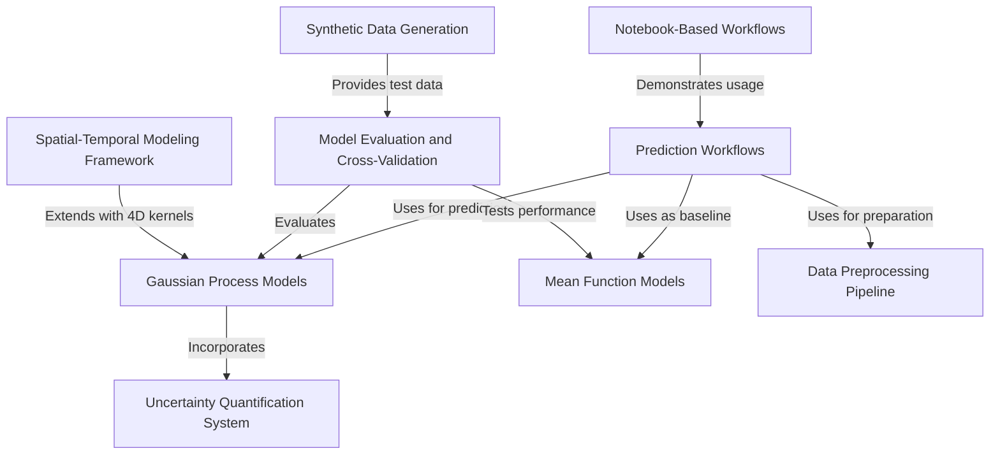

# Tutorial: AgReFed-ML

**AgReFed-ML** is a machine learning framework specifically designed for **agricultural soil modeling**. It transforms *sparse soil measurements* into detailed **spatial-temporal prediction maps** of soil properties and their **uncertainties** using advanced *Gaussian Process regression*. The system combines traditional machine learning models (like Random Forest and Bayesian Linear Regression) as **mean functions** with sophisticated *spatial correlation modeling* to make accurate predictions even with limited data. It's particularly valuable for **precision agriculture** applications like carbon accounting, soil moisture mapping, and property change detection over time.

**Source Repository:** [https://github.com/Sydney-Informatics-Hub/AgReFed-ML](https://github.com/Sydney-Informatics-Hub/AgReFed-ML)

## Chapters

1. [Notebook-Based Workflows
](01_notebook_based_workflows_.html)
2. [Prediction Workflows
](02_prediction_workflows_.html)
3. [Data Preprocessing Pipeline
](03_data_preprocessing_pipeline_.html)
4. [Mean Function Models  
](04_mean_function_models___.html)
5. [Gaussian Process Models
](05_gaussian_process_models_.html)
6. [Uncertainty Quantification System
](06_uncertainty_quantification_system_.html)
7. [Spatial-Temporal Modeling Framework
](07_spatial_temporal_modeling_framework_.html)
8. [Synthetic Data Generation
](08_synthetic_data_generation_.html)
9. [Model Evaluation and Cross-Validation
](09_model_evaluation_and_cross_validation_.html)

---
